# xv6 及 Labs 课程项目文档

**源码链接：**https://github.com/Lanqi2345/xv6-labs-2020.git

[TOC]

------

## 环境配置

个人电脑的操作系统为**Windows 11**

### 一、安装 WSL 2

####  1. 启用所需Windows功能

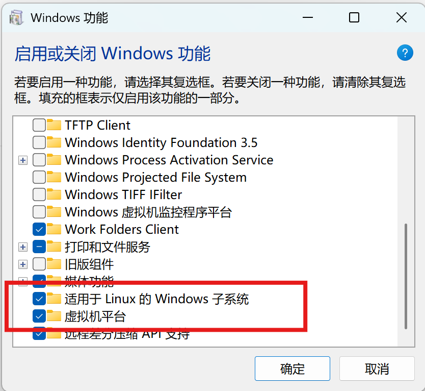

确保勾选“虚拟机平台”和“适用于Linux的Windows子系统”

#### 2. 安装Ubuntu

查看可安装的Linux发行版

```cmd
wsl --list --online
```

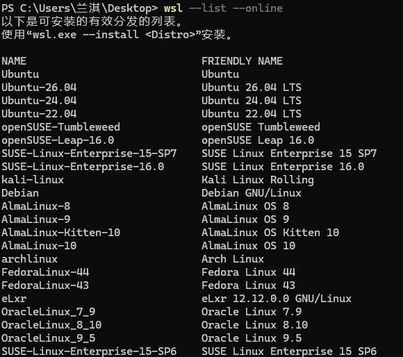

安装

```cmd
wsl.exe --install Ubuntu
```

检查版本

```cmd
wsl -l -v
```

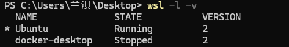

初次打开，进行设置用户名和密码设置。

### 二、配置XV6系统环境

#### 1. 前置准备

参考博客[Mit6.s081环境配置踩坑之旅WSL2+VScode_mit6s081-CSDN博客](https://blog.csdn.net/John_Snowww/article/details/129972288)进行换源，提升网络速度。

输入：

```bash
sudo vim /etc/apt/sources.list
```

进入编辑界面，按`“gg”`定位到所有行的开头，按`“dG”`删掉所有内容。按键盘上的`“INSERT”`键进行编辑，复制中科大的源。

```
deb https://mirrors.ustc.edu.cn/ubuntu/ focal main restricted universe multiverse
deb-src https://mirrors.ustc.edu.cn/ubuntu/ focal main restricted universe multiverse
deb https://mirrors.ustc.edu.cn/ubuntu/ focal-updates main restricted universe multiverse
deb-src https://mirrors.ustc.edu.cn/ubuntu/ focal-updates main restricted universe multiverse
deb https://mirrors.ustc.edu.cn/ubuntu/ focal-backports main restricted universe multiverse
deb-src https://mirrors.ustc.edu.cn/ubuntu/ focal-backports main restricted universe multiverse
deb https://mirrors.ustc.edu.cn/ubuntu/ focal-security main restricted universe multiverse
deb-src https://mirrors.ustc.edu.cn/ubuntu/ focal-security main restricted universe multiverse
deb https://mirrors.ustc.edu.cn/ubuntu/ focal-proposed main restricted universe multiverse
deb-src https://mirrors.ustc.edu.cn/ubuntu/ focal-proposed main restricted universe multiverse
```

按`“ESC”`按键退出编辑模式。然后按下`“：wq！”`进行保存退出。 

更新系统：

```bash
sudo apt update
sudo apt upgrade
```

安装QEMU等必备包：

```bash
sudo apt-get install git build-essential gdb-multiarch qemu-system-misc gcc-riscv64-linux-gnu binutils-riscv64-linux-gnu
```

测试是否安装成功

```bash
riscv64-unknown-elf-gcc --version
qemu-system-riscv64 --version
```

如有报错，按照给的提示来解决。

#### 2.安装XV6

将XV6代码克隆到本地。

```bash
git clone git://g.csail.mit.edu/xv6-labs-2020
```

进入克隆文件夹:

```bash
cd xv6-labs-2020/
```

切换到第一个实验分支

```bash
git checkout util
```

编译xv6并开启模拟器

```bash
make qemu
```

按下`ctrl+a`松开后再按`x`退出qemu.

如果失败，参考[Mit6.s081环境配置踩坑之旅WSL2+VScode_mit6s081-CSDN博客](https://blog.csdn.net/John_Snowww/article/details/129972288)解决，大概是因为Ubuntu系统的版本过高，默认安装的qemu模拟器与xv6内核不兼容，导致编译不成功。

此外，实验过程中每个分支编译时都会出现：

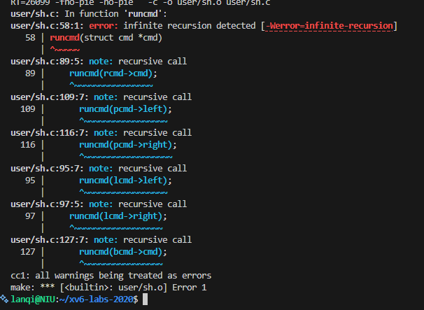

这是新版 GCC 对 2020 年旧代码产生的兼容性警告。

**解决：**

在WSL的 xv6 项目目录中执行：

```bash
cd ~/xv6-labs-2020
nano Makefile
```

找到定义 `CFLAGS` 的位置：

```bash
CFLAGS = -Wall -Werror -O -fno-omit-frame-pointer -ggdb
```

改为：

```bash
CFLAGS = -Wall -Werror -Wno-error=infinite-recursion -O -fno-omit-frame-pointer -ggdb
```

再次编译即可。

### 三、关于`git`的使用

#### 1. 建立自己的仓库

在 GitHub 上创建一个新仓库

https://github.com/Lanqi2345/xv6-labs-2020.git

#### 2. 修改本地代码的“关联”

查看当前的关联（指向 MIT 的）：

```bash
git remote -v
```

修改原来的关联的名字：

```bash
git remote rename origin upstream
```

添加自己的仓库作为新的 `origin`：

```bash
git remote add origin <仓库链接>
```

再次查看验证：

```bash
git remote -v
```

`origin` 现在指向自己的账号

#### 3.推送

把本地的代码推送：

```bash
# 假设当前在 util 分支
git push -u origin util
```


------

## Lab: Xv6 and Unix utilities

### Boot xv6

**要求：**

本实验主要是搭建环境并熟悉 xv6 操作系统。

**步骤：**

实验环境搭建请参考“环境配置”部分，构建并运行 xv6：

切换到`util`分支

```
git checkout util
make qemu
```

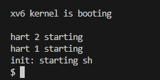

### sleep

**要求：**

为 xv6 操作系统实现一个用户态程序 `sleep`，使其能够暂停指定的时间片（ticks）数量。练习如何编写用户程序、处理命令行参数、使用系统调用以及将新程序集成到 xv6 构建系统中。

**解决：**

在 `user/` 目录下创建一个名为 `sleep.c` 的文件，写入：

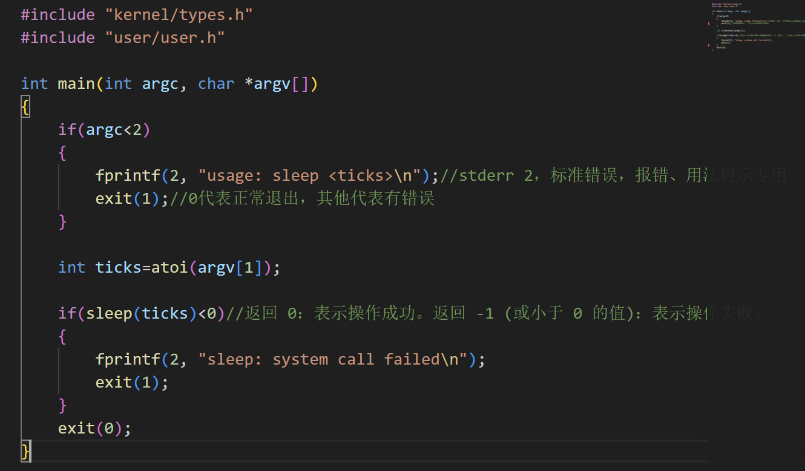

在 `Makefile` 文件中，`UPROGS`下添加`$U/_sleep\`，并进行编译。

### pingpong

**要求：**

为 xv6 操作系统实现一个用户态程序 `pingpong`，使用两条管道在父子进程之间双向传递一个字节。父进程发送字节后，子进程接收并打印 `"<pid>: received ping"`，再将该字节传回父进程；父进程接收后打印 `"<pid>: received pong"`。练习使用 `pipe`、`fork`、`read`、`write`、`getpid` 等 UNIX 系统调用，以及将新程序集成到 xv6 构建系统中。

**解决：**

在 `user/` 目录下创建一个名为 `pingpong.c` 的文件，实现：

1. 使用 `pipe()` 创建两条单向管道，分别用于父进程向子进程发送数据和子进程向父进程返回数据。
2. 使用 `fork()` 创建子进程。
3. 父子进程分别关闭自己不使用的管道端口。
4. 父进程通过第一条管道向子进程发送一个字节。
5. 子进程读取该字节，打印 `received ping`，再通过第二条管道将字节传回父进程并退出。
6. 父进程读取返回的字节，打印 `received pong`，使用 `wait()` 回收子进程后退出。
7. 对管道创建、进程创建和字节读写进行错误检查，并及时关闭使用完毕的文件描述符。

在 `Makefile` 文件的 `UPROGS` 下添加 `$U/_pingpong\`，并进行编译运行。

### primes

**要求：**

为 xv6 实现用户态程序 `primes`，使用 `pipe` 和 `fork` 构建并发素数筛选管道。程序将 2～35 依次传入管道，每个进程负责筛选一个素数的倍数，最终输出所有素数。练习进程创建、管道通信和文件描述符管理。

**解决：**

在 `user/` 目录下创建一个名为 `primes.c` 的文件，实现：

1. 使用 `pipe()` 创建管道，并由主进程将 2～35 写入管道。
2. 使用 `fork()` 创建素数筛选进程。
3. 每个筛选进程读取第一个数字，将其作为素数输出。
4. 筛选掉该素数的倍数，并将剩余数字传给下一个进程。
5. 递归创建管道和子进程，直到没有数字需要处理。
6. 及时关闭不使用的管道端口，并使用 `wait()` 回收子进程。

在 `Makefile` 的 `UPROGS` 下添加 `$U/_primes\`，然后编译运行。

### find

**要求：**

为 xv6 实现用户态程序 `find`，根据指定名称递归查找目录树中的文件，并输出匹配文件的完整路径。程序需要读取目录内容、区分文件和子目录、跳过 `.` 与 `..`，并使用 `strcmp()` 比较文件名。

**解决：**

在 `user/` 目录下创建一个名为 `find.c` 的文件，实现：

1. 使用 `open()` 打开指定路径，并通过 `fstat()` 获取文件类型。
2. 获取路径的最后一部分，并使用 `strcmp()` 与目标名称比较。
3. 如果名称匹配，则输出该文件或目录的完整路径。
4. 如果当前路径是目录，则使用 `read()` 依次读取其中的目录项。
5. 跳过无效目录项以及 `.` 和 `..`，避免无限递归。
6. 拼接子路径并递归调用 `find()`，继续查找子目录。
7. 检查路径长度，并及时关闭文件描述符。

在 `Makefile` 的 `UPROGS` 下添加 `$U/_find\`，然后编译运行。

### xargs

**要求：**

为 xv6 实现用户态程序 `xargs`，逐行读取标准输入，将每行内容作为附加参数，与原有命令参数组合后执行该命令。程序需要使用 `fork()` 创建子进程、使用 `exec()` 执行命令，并由父进程通过 `wait()` 等待命令完成，进行标准输入处理、命令参数构造和进程控制。

**解决：**

在 `user/` 目录下创建一个名为 `xargs.c` 的文件，实现：

1. 保存 `xargs` 后原有的命令及参数。
2. 使用 `read()` 从标准输入逐字符读取内容，并按换行符划分输入行。
3. 将每行内容按空格或制表符拆分成附加参数。
4. 将原有参数和附加参数组合成新的参数数组，并在末尾添加空指针。
5. 使用 `fork()` 创建子进程，并通过 `exec()` 执行组合后的命令。
6. 父进程使用 `wait()` 等待子进程结束，再处理下一行输入。
7. 检查参数数量、输入长度以及进程创建和命令执行错误。

在 `Makefile` 的 `UPROGS` 下添加 `$U/_xargs\`，然后编译运行。

### Lab总结

**实验结果：**

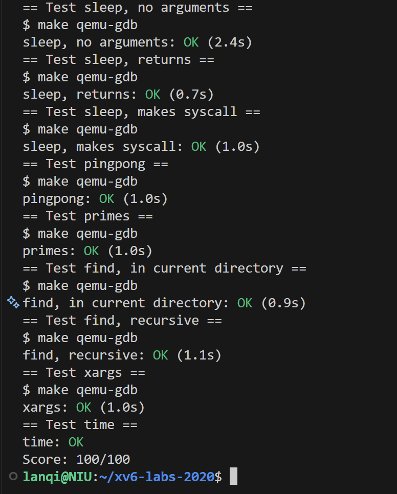

**问题与解决**

在本阶段的实验中，最大的问题就是我一开始无法理解函数之间的调用逻辑。比如在编写 `sleep.c` 时，我无法区分自己编写的用户程序与系统原本提供的 `sleep()` 函数，也不理解用户程序如何调用内核函数，以及在命令行中输入命令后，系统如何运行 `sleep.c` 中的 `main()` 函数。通过阅读书籍以及查阅相关资料，我对此有了初步认识：

当在 xv6 的 shell 中输入 `sleep 10` 时，shell 会解析命令和参数，然后通过 `fork()` 创建子进程，并使用 `exec()` 加载已经编译好的 `sleep` 用户程序。程序开始运行后，首先进入 `main()` 函数，其中 `argc` 表示参数数量，`argv` 用于保存命令及其参数。程序通过 `atoi()` 将字符串形式的 `"10"` 转换为整数，再调用系统提供的 `sleep()`。

我编写的 `sleep.c` 是一个完整的用户态命令，而其中调用的 `sleep()` 是 xv6 提供的系统调用，两者虽然名称相同，但作用不同。用户程序中的 `sleep()` 调用会通过系统调用入口进入内核，由内核中的 `sys_sleep()` 完成真正的进程暂停操作。用户程序不能直接执行内核函数，而是需要通过系统调用完成从用户态到内核态的切换。理解这一过程后，我对用户程序、系统调用和内核函数之间的关系有了更加清晰的认识。

在 `user/sleep.c` 中调用 `sleep(ticks)` 时，它的实现过程可以分为以下三个层次。

**第一层：函数声明**

在 `sleep.c` 中包含：

```c
#include "user/user.h"
```

编译器会读取 `user/user.h` 中的声明：

```c
int sleep(int);
```

这条声明告诉编译器，系统中存在一个名为 `sleep` 的函数，它接收一个整数参数并返回一个整数。头文件只说明函数应该如何调用，并不包含真正的实现。

**第二层：用户态系统调用存根**

系统调用的用户态入口位于 `user/usys.S` 中。这里使用一小段汇编代码完成系统调用号的设置和用户态到内核态的切换，其逻辑类似于：

```S
.global sleep
sleep:
 li a7, SYS_sleep
 ecall
 ret
```

其中，`li a7, SYS_sleep` 将 `sleep` 对应的系统调用号放入 `a7` 寄存器；`ecall` 指令触发陷阱，使 CPU 从用户模式进入内核模式；内核处理完成后，`ret` 再返回用户程序。

**第三层：内核中的实际处理函数**

进入内核后，系统会读取 `a7` 寄存器中的系统调用号，并根据系统调用表找到对应的处理函数。`sleep` 最终会调用位于 `kernel/sysproc.c` 中的`sys_sleep`，这里是真正完成进程休眠操作的地方。用户程序不能直接调用内核函数，而是必须通过系统调用接口，请求内核提供相应服务。

**实验心得**

通过本次实验，我对 xv6 用户程序的编写、编译和运行过程有了更加清晰的认识。`sleep` 实验让我掌握了命令行参数处理和系统调用的基本使用方法；`pingpong` 实验帮助我理解了管道的单向通信特点以及父子进程之间的数据交换；`primes` 实验进一步展示了如何利用进程和管道组成并发流水线。在 `find` 实验中，我学习了目录项读取、文件类型判断、路径拼接和递归遍历等文件系统操作；在 `xargs` 实验中，我掌握了标准输入读取、字符串拆分、参数数组构造以及 `fork()`、`exec()` 和 `wait()` 的配合使用。

这次实验，让我对操作系统有了进一步的认知与理解，也增加了对某些命令行的理解，比如，之前知道管道运算符与`xargs`命令，但从未了解命令本身的实现原理。


------

## Lab: system calls

### System call tracing

**要求：**

为 xv6 内核添加系统调用跟踪功能，实现新的 `trace` 系统调用。程序通过掩码指定需要跟踪的系统调用，内核在对应系统调用返回时输出进程 PID、系统调用名称和返回值。跟踪设置需要对调用进程及其后续创建的子进程生效，但不能影响其他进程。实现添加系统调用、修改进程结构、继承进程状态以及理解系统调用的执行流程。

**解决：**

1. 切换到 syscall 分支

```bash
git checkout syscall
```

2. 把 trace 用户程序加入编译

在 `Makefile` 的 `UPROGS` 下添加 `$U/_trace\`。

3. 在 `user/user.h` 声明 `trace()`

因为 `user/trace.c` 需要调用`trace(mask)`;

```c
int trace(int);
```

4. 在 `user/usys.pl` 添加系统调用桩

添加

```
entry("trace");
```

编译时，`usys.pl` 会自动生成 `user/usys.S`，负责把 `trace` 的系统调用编号放入 `a7`；使用 `ecall` 从用户态进入内核；系统调用结束后返回用户态。

5. 给 `trace` 分配系统调用编号

在`kernel/syscall.h`添加：

```c
#define SYS_trace 22
```

6. 在进程结构中添加`trace_mask`

在`kernel/proc.h`中的`struct proc`添加

```c
int trace_mask;
```

让每个进程都有自己独立的跟踪掩码。

7. 初始化 `trace_mask`

在`kernel/proc.c`中的`allocproc`添加

```c
p->trace_mask = 0;
```

8. 在内核中实现 `sys_trace()`

在`kernel/sysproc.c`中添加：

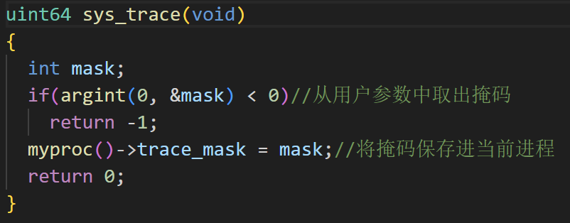

9. 向内核声明 `sys_trace()`

在`kernel/syscall.c`中添加

```c
extern uint64 sys_trace(void);
```

10. 把编号22映射到 `sys_trace()`

在`kernel/syscall.c`中添加

```
[SYS_trace] sys_trace,
```

11. 让 `fork()` 复制 trace_mask

在`kernel/proc.c`的`fork`中添加

```c
// 子进程继承父进程的跟踪掩码
np->trace_mask = p->trace_mask;
```

12. 添加系统调用名称数组

在 `kernel/syscall.c` 中添加：

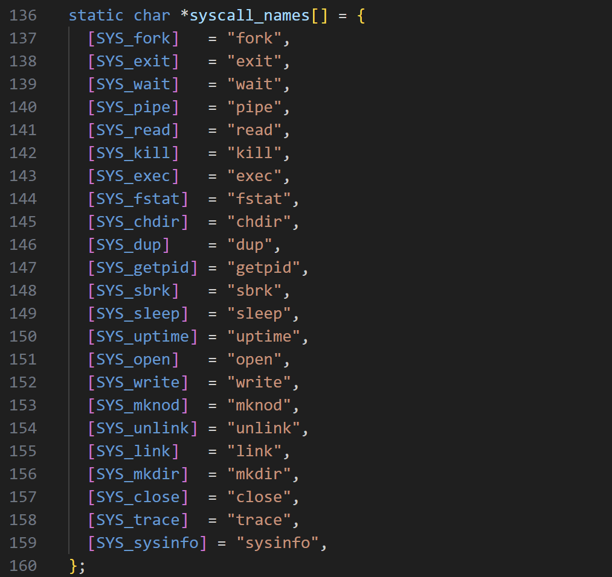

13. 在 `syscall()` 中检查掩码

在`kernel/syscall.c`中添加

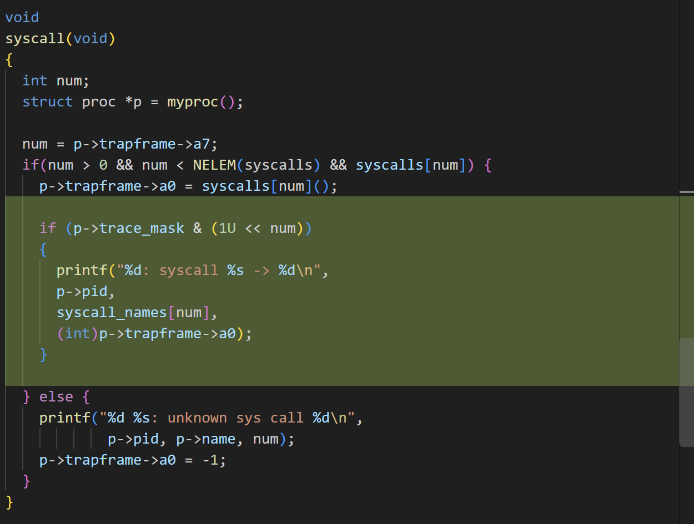

### Sysinfo

**要求：**

为 xv6 内核添加 `sysinfo` 系统调用，用于获取系统当前运行状态。内核需要统计空闲内存的字节数和状态不为 `UNUSED` 的进程数量，将结果写入 `struct sysinfo` 并复制到用户空间。实现添加系统调用、统计内核资源以及使用 `copyout()` 在内核与用户空间之间传递数据。

**解决：**

1. 把测试程序加入编译

在 `Makefile` 的 `UPROGS` 下添加：

```makefile
$U/_sysinfotest\
```

2. 在 `user/user.h` 声明 `sysinfo()`

```c
struct sysinfo;
int sysinfo(struct sysinfo *);
```

 `struct sysinfo;` 是结构体的前向声明。

3. 在 `user/usys.pl` 添加系统调用桩

```
entry("sysinfo");
```

编译时会自动生成汇编桩，通过 `ecall` 从用户态进入内核。

4. 给 `sysinfo` 分配系统调用编号

在 `kernel/syscall.h` 中添加：

```c
#define SYS_sysinfo 23
```

5. 在内核中声明 `sys_sysinfo()`

在 `kernel/syscall.c` 中添加：

```c
extern uint64 sys_sysinfo(void);
```

6. 注册 `sysinfo` 系统调用

在 `kernel/syscall.c` 的 `syscalls[]` 数组中添加：

```c
[SYS_sysinfo] sys_sysinfo,
```

对于已经完成的 `trace` 实验，还需要在系统调用名称数组中添加：

```c
[SYS_sysinfo] = "sysinfo",
```

7. 声明资源统计函数

在 `kernel/defs.h` 中添加：

```c
uint64 freemem(void);
int nproc(void);
```

分别用于统计空闲内存和系统进程数量。

8. 实现统计空闲内存

在 `kernel/kalloc.c` 中遍历空闲页链表，每个空闲链表节点代表一个物理页，因此每找到一个节点就增加 `PGSIZE` 字节。

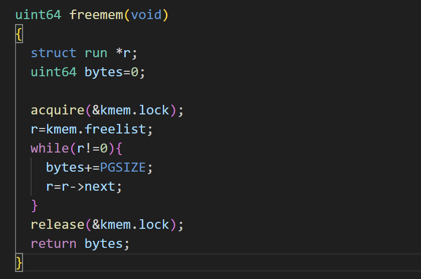

9. 实现统计进程数量

在 `kernel/proc.c` 中遍历进程表，统计所有状态不为 `UNUSED` 的进程。

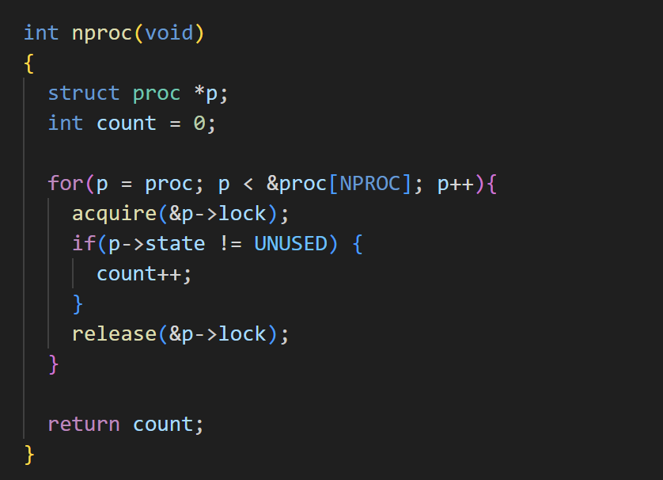

10. 实现 `sys_sysinfo()`

在 `kernel/sysproc.c` 中包含：

```
#include "sysinfo.h"
```

然后实现系统调用：

- `argaddr()` 获取用户传入的结构体地址；
- `freemem()` 获取空闲内存字节数；
- `nproc()`获取当前进程数量；
- `copyout()` 将内核中的统计结果复制到用户空间。

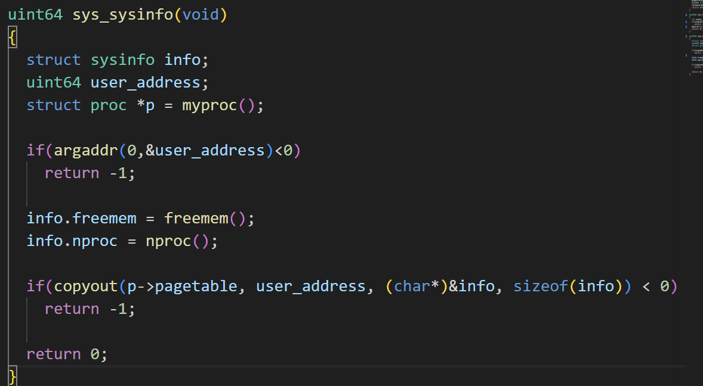

### Lab总结

**实验结果：**

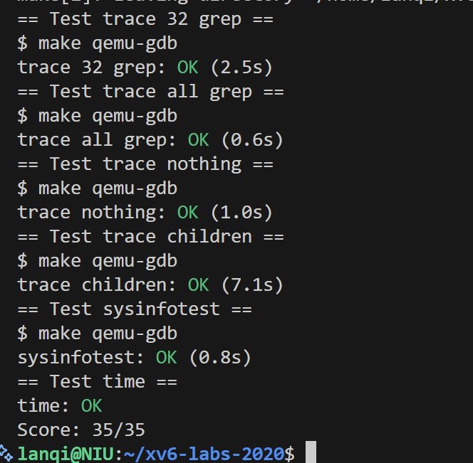

**问题与解决**

1. 新增系统调用后无法编译

在加入 `trace` 和 `sysinfo` 后，用户程序出现函数未声明或找不到系统调用入口的问题。原因是新增系统调用需要同时连接用户态和内核态。

解决方法是在以下文件中补充相应内容：

- 在 `user/user.h` 中声明系统调用；
- 在 `user/usys.pl` 中添加系统调用桩；
- 在 `kernel/syscall.h` 中分配不重复的系统调用编号；
- 在 `kernel/syscall.c` 中声明内核函数并加入系统调用映射表。

完成这些步骤后，用户程序才能通过 `ecall` 正确进入内核。

2. `sysinfo()` 无法将结果返回用户空间

`sys_sysinfo()` 中统计出的数据位于内核空间，不能直接通过用户传入的指针进行赋值。解决方法是先使用 `argaddr()` 获取用户空间地址，再使用 `copyout()` 根据当前进程的页表将 `struct sysinfo` 复制到用户空间。

**实验心得**

通过本次实验，我进一步理解了 xv6 系统调用从用户态进入内核态的完整过程。一个新的系统调用不仅需要实现内核函数，还需要完成用户态声明、汇编调用桩、系统调用编号和内核分发表等多个环节。任何一个环节缺失，都可能造成编译、链接或运行错误。

总体来说，这两个实验让我对 xv6 的系统调用机制、进程管理、内存管理以及内核并发控制有了更深入的认识，也提高了我根据编译错误和测试结果逐步定位问题的能力。


------

## Lab: page tables

### Print a page table

**要求：**

为 xv6 内核实现 `vmprint()` 函数，递归遍历并打印指定的三级 RISC-V 页表。输出需要包含有效页表项的层级、索引、PTE 值和对应物理地址，并在第一个进程完成 `exec()` 时打印其页表。从而实现理解多级页表结构、页表项标志、虚拟地址映射以及用户访问权限。

**解决：**

1. 切换到 `pgtbl` 分支

```bash
git checkout pgtbl
```

2. 参考页表释放函数

在 `kernel/vm.c` 中查看 `freewalk()`。

了解到判断 PTE 有效：

```c
pte & PTE_V
```

判断 PTE 指向下一级页表：

```c
(pte & (PTE_R | PTE_W | PTE_X)) == 0
```

3. 实现递归遍历函数与`vmprint()`函数

在 `kernel/vm.c` 中添加：

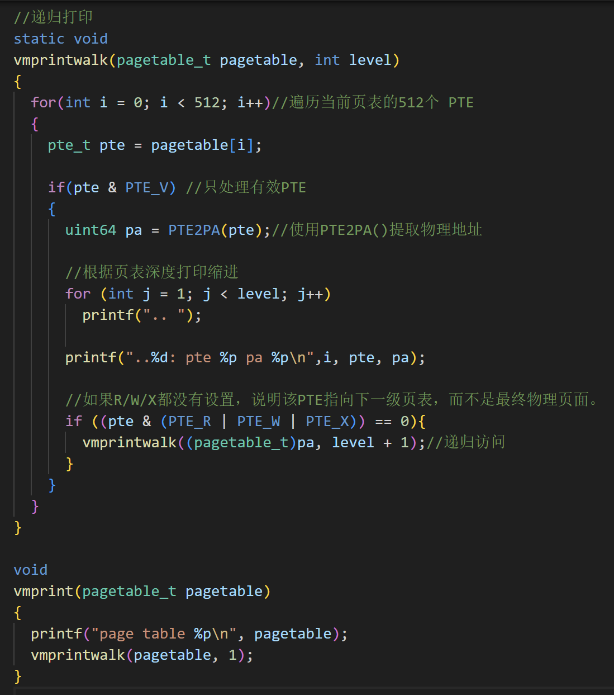

4. 声明 `vmprint()`

在 `kernel/defs.h` 的 `vm.c` 函数声明区域添加：

```c
void vmprint(pagetable_t);
```

5. 在第一个进程执行 `exec()` 后打印页表

添加：

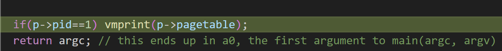

### A kernel page table per process

**要求：**

修改 xv6 内核，为每个进程创建并维护一份独立的内核页表，使进程进入内核态后使用自己的内核页表。需要为页表建立必要的内核映射和进程内核栈映射，在进程调度时切换页表，并在没有进程运行时恢复全局内核页表，最后在进程释放时正确释放其内核页表。实现页表创建、内核栈映射、进程调度和内存资源管理。

**解决：**

1. 在进程结构中保存独立内核页表

在 `kernel/proc.h` 的 `struct proc` 中添加：

```c
pagetable_t kpagetable; // 进程独立的内核页表
```

2. 在 `kernel/defs.h` 声明相关函数

将 `kvmmap()` 修改为可以操作指定页表，并添加创建、释放函数：

```c
pagetable_t kvmmake(void); //创建并返回内核页表
void kvmmap(pagetable_t, uint64, uint64, uint64, int); //接收页表参数
void kvmfree(pagetable_t); //进程退出后需要释放内核页表
```

3. 修改 `kvmmap()`

在 `kernel/vm.c` 中，将原来只能操作全局内核页表的函数改为：

```c
void kvmmap(pagetable_t pagetable, uint64 va,uint64 pa, uint64 sz, int perm)
{
  if (mappages(pagetable, va, sz, pa, perm) != 0)
    panic("kvmmap");
}
```

这样既可以修改全局内核页表，也可以修改某个进程的内核页表。

4. 实现 `kvmmake()`

在 `kernel/vm.c` 中实现创建内核页表的函数，映射内容参考 `kvminit()` 中的映射。

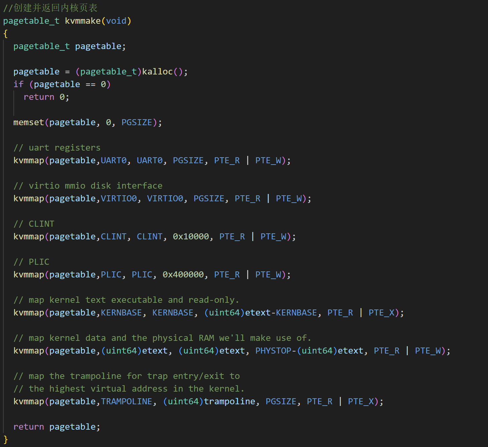

5. 修改 `kvminit()`

在 `kernel/vm.c` 中使用 `kvmmake()` 创建全局内核页表：

```c
void
kvminit(void)
{
  kernel_pagetable = kvmmake();
  if (kernel_pagetable == 0)
    panic("kvminit");
}
```

6. 修改 `procinit()`

在 `kernel/proc.c` 的 `procinit()` 中，删除提前为所有进程分配和映射内核栈的代码，只初始化进程锁和相关字段，内核栈改为在真正创建进程时分配。

```c
for (p = proc; p < &proc[NPROC]; p++) {
  initlock(&p->lock, "proc");
  p->kstack = 0;
  p->kpagetable = 0;
}
```

7. 在 `allocproc()` 中创建进程内核页表，为进程分配并映射内核栈

在 `kernel/proc.c` 的 `allocproc()` 中加入：

```c
  // 为新进程创建独立的内核页表，并将内核所需要的各种映射添加到新页表上
  p->kpagetable = kvmmake();
```

在 `allocproc()` 中分配内核栈物理页：

```c
 // 分配一个物理页，作为新进程的内核栈使用
  char *pa = kalloc();
  if(pa == 0)
    panic("kalloc");
  uint64 va = KSTACK((int) (p - proc)); // 将内核栈映射到固定的逻辑地址上
  kvmmap(p->kpagetable, va, (uint64)pa, PGSIZE, PTE_R | PTE_W);
  p->kstack = va;
```

8. 实现内核页表释放函数

在 `kernel/vm.c` 中添加：

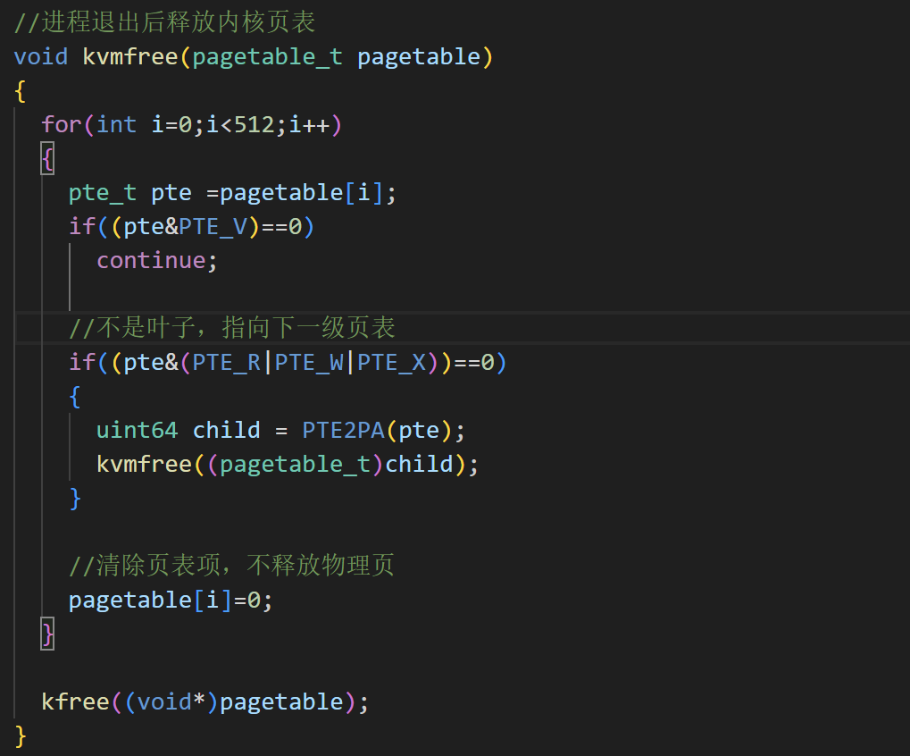

该函数只释放页表结构页，不释放内核代码、设备地址等叶子 PTE 指向的共享物理内存。

9. 在 `freeproc()` 中释放内核栈和页表

在 `kernel/proc.c` 的 `freeproc()` 中添加：

```c
  //先释放内核栈物理页
  if (p->kpagetable && p->kstack)
  {
    uvmunmap(p->kpagetable,p->kstack,1,1);
    p->kstack = 0;
  }

  //释放页表结构页，不释放共享内核叶子物理页。
  if (p->kpagetable)
  {
    kvmfree(p->kpagetable);
    p->kpagetable = 0;
  }
```

10. 在调度器中切换内核页表

在 `kernel/proc.c` 的 `scheduler()` 中，修改：

```c
//使用p自己的内核页表
w_satp(MAKE_SATP(p->kpagetable)); 
sfence_vma();//清除旧页表对应的 TLB 缓存

swtch(&c->context, &p->context);

//恢复全局内核页表
kvminithart(); 
```

`sfence_vma()` 用于清除旧页表对应的 TLB 缓存。

11. 修改 `kvmpa()`

在 `kernel/vm.c` 中，让 `kvmpa()` 优先使用当前进程的内核页表：

```c
struct proc *p = myproc();
pagetable_t pagetable;

if (p != 0 && p->kpagetable != 0)
  pagetable = p->kpagetable;
else
  pagetable = kernel_pagetable;

pte = walk(pagetable, va, 0);
```

12.  修改 `kernel/vm.c` 的头文件

在 `kernel/vm.c` 中加入：

```c
#include "spinlock.h"
#include "proc.h"
```

### Simplify

**要求：**

在上一题的基础上，将每个进程的用户内存映射同步到其独立内核页表，使内核能够直接访问用户虚拟地址，并使用 `copyin_new()` 和 `copyinstr_new()` 简化用户数据复制。需要在 `userinit()`、`fork()`、`exec()` 和 `sbrk()` 等用户地址空间发生变化的位置同步页表映射，清除内核页表中用户页面的 `PTE_U` 权限，并限制进程地址空间不能超过 `PLIC` 地址，同时理解地址加法溢出检查的作用。

**解决：**

1. 实现用户映射同步函数

在 `kernel/vm.c` 中添加：

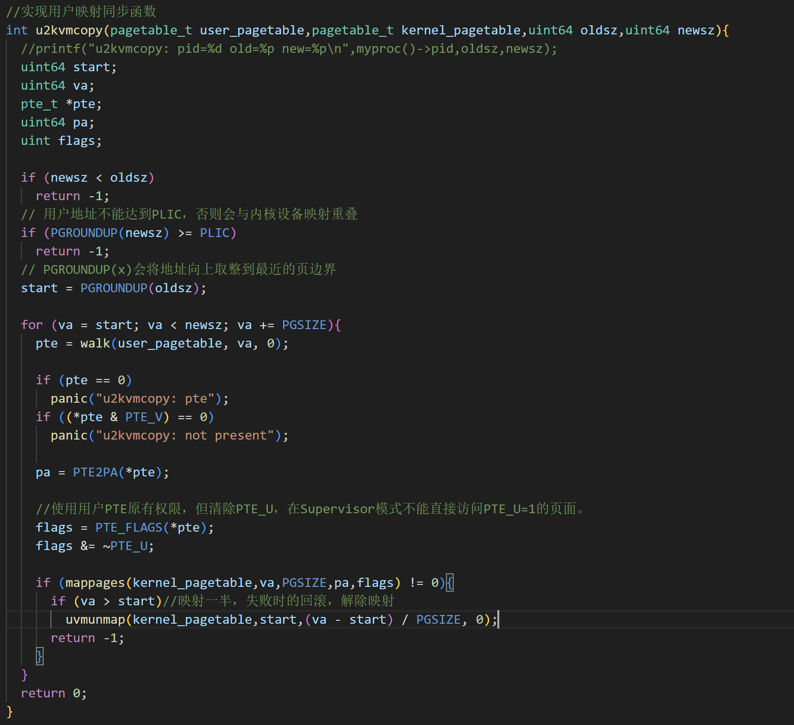

这个函数让两个页表中的叶子 PTE 指向同一个物理页，而且必须清除内核页表中的 `PTE_U`，否则 RISC-V 内核态不能直接访问该映射。

2. 在 `kernel/defs.h` 声明函数`u2kvmcopy`

```c
int u2kvmcopy(pagetable_t,pagetable_t ,uint64 ,uint64);
```

3. 为第一个进程同步用户映射

在 `kernel/proc.c` 的 `userinit()` 中添加：

```c
//用户地址的内核映射
if (u2kvmcopy(p->pagetable,p->kpagetable,0,p->sz) < 0) {
	panic("userinit: u2kvmcopy");
}
```

给第一个 `init` 进程的内核页表中添加用户内存映射。

4. 在 `fork()` 中同步子进程映射

在 `kernel/proc.c` 的 `fork()` 中，完成用户页表复制后添加：

```c
//把子进程用户页表中的用户页面，映射到子进程自己的内核页表中。
if (u2kvmcopy(np->pagetable,np->kpagetable,0,np->sz) < 0){
    freeproc(np);
    release(&np->lock);
    return -1;
}
```

5. 限制用户地址空间大小

在 `kernel/vm.c` 的 `uvmalloc()` 中开始部分添加：

```c
if (newsz >= PLIC)
  return 0;
```

因为用户虚拟地址不能达到 `PLIC`，否则会与内核页表中的设备映射发生冲突。

6. 修改 `growproc()` 处理内存增长

在 `kernel/proc.c` 的 `growproc()` 中，当 `sbrk()` 扩大地址空间时，同步新增映射，扩大内存时建立新的内核别名映射；缩小内存时删除对应映射，但不能再次释放物理页， `uvmunmap()` 的最后一个参数是 `0`。

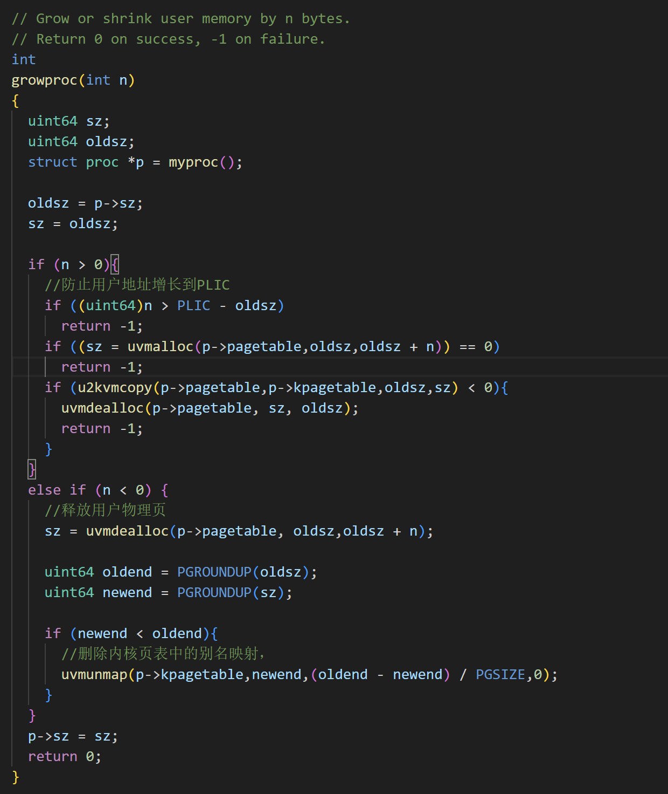

7. 在 `exec()` 中同步新程序映射

在 `kernel/exec.c` 中，所有 ELF 加载、用户栈构造和参数复制成功后，先删除旧程序在内核页表中的映射，然后添加新程序的映射：

```c
oldsz = p->sz;
//删除旧用户地址在内核页表中的映射
if (oldsz > 0){
    uvmunmap(p->kpagetable,0,PGROUNDUP(oldsz) / PGSIZE,0);
}
//新用户页表映射同步到内核页表
if (u2kvmcopy(pagetable,p->kpagetable,0,sz) < 0){
    //恢复旧映射，保证exec失败时旧程序仍能运行。
    if (oldsz > 0 && u2kvmcopy(p->pagetable,p->kpagetable,0,oldsz) < 0){
        //恢复失败
        panic("exec: restore kpagetable");
    }
    goto bad;//失败继续执行旧程序
}
```

8. 使用 `copyin_new()`

在 `kernel/vm.c` 中，将 `copyin()` 的函数体替换为：

```c
//把数据复制进内核
int copyin(pagetable_t pagetable, char *dst, uint64 srcva, uint64 len)
{
  return copyin_new(pagetable, dst, srcva, len);
}
```

9. 使用 `copyinstr_new()`

将 `copyinstr()` 的函数体替换为：

```c
int copyinstr(pagetable_t pagetable, char *dst, uint64 srcva, uint64 max){
  return copyinstr_new(pagetable, dst, srcva, max);
}
```

10. 从每进程内核页表中删除 `CLINT` 映射

```c
// CLINT
//CLINT 映射冲突
//kvmmap(pagetable,CLINT, CLINT, 0x10000, PTE_R | PTE_W);
```

同时在`kvminit()`中添加：

```c
//单独给全局内核页表映射 CLINT
kvmmap(kernel_pagetable, CLINT, CLINT, 0x10000, PTE_R | PTE_W);
```

对于题目中的两个问题：

创建`answers-pgtbl.txt`并回答：

问题一：

`vmprint` 输出的是三级页表结构。
第 0 页存放 `init` 进程的程序代码和数据。
第 1 页是用户栈的保护页。该页面对应的页表项没有设置 `PTE_U` 标志，因此进程在用户模式下不能读取或写入该页面。如果用户程序尝试访问它，CPU 将产生页面错误。
第 2 页存放用户栈。

问题二:
三个判断为`srcva >= p->sz || srcva+len >= p->sz || srcva+len < srcva`

`srcva + len < srcva`用于检测无符号64位整数加法是否发生溢出。

例如，假设进程大小 `p->sz` 为 4096，并令：

`srcva = 1`
`len = 0xffffffffffffffff`

在数学上，两者之和超出了 `uint64` 能表示的范围。由于无符号整数运算会回绕，`srcva + len` 的实际结果会变成 0。

此时 `srcva` 小于 `p->sz`，并且溢出后的 `srcva + len` 也小于`p->sz`，因此前面的边界检查可能无法发现问题。

但是`srcva + len < srcva`等价于：`0 < 1`，结果为真，因此可以检测出此次整数溢出并返回错误，防止内核访问错误的用户地址。

### Lab总结

**实验结果：**

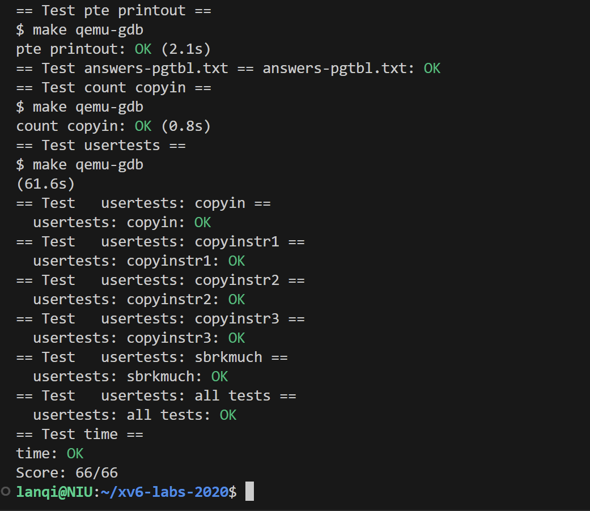

**问题与解决**

1. 页表打印格式和递归层级不正确

在实现 `vmprint()` 时，最初不容易区分叶子页表项与指向下一级页表的页表项。如果对所有有效 PTE 都递归，会把普通物理页误当作页表访问，导致异常。

解决方法是参考 `freewalk()`：首先通过 `PTE_V` 判断页表项是否有效，再检查 `PTE_R`、`PTE_W` 和 `PTE_X`。当三个位都没有设置时，说明该 PTE 指向下一级页表，可以递归遍历。同时通过递归深度控制 `..` 的数量，使输出格式符合测试要求。

2. CLINT 映射与用户地址空间发生冲突

创建进程独立内核页表时，最初按照全局内核页表复制了 CLINT 映射：

```c
//CLINT
kvmmap(pagetable, CLINT, CLINT,0x10000, PTE_R | PTE_W);
```

CLINT 位于较低的虚拟地址。但是在第三个任务中，将用户地址映射复制到进程内核页表，用户地址空间增长后可能与 CLINT 映射重叠，导致 `mappages()` 报错或产生映射冲突。于是在进程的独立内核页表中取消 CLINT 映射：

```c
//CLINT 映射冲突
//kvmmap(pagetable,CLINT, CLINT, 0x10000, PTE_R | PTE_W);
```

CLINT 主要由机器模式下的定时器初始化代码访问，不需要出现在进程运行时使用的内核页表中。移除该映射后，进程内核页表中最低的内核映射地址变为 `PLIC`，因此用户地址空间必须限制在 `PLIC` 以下。

但是还要保留全局页表需要的映射：

```c
//单独给全局内核页表映射 CLINT
kvmmap(kernel_pagetable, CLINT, CLINT, 0x10000, PTE_R | PTE_W);
```

**实验心得**

这次实验是我消耗时长最长的一个实验，最初进行实验时，由于对用户态以及内核态本身的理解不够，我不太理解为什么需要为每个进程重新创建一张内核页表。原来的 xv6 已经具有全局内核页表，而每个进程也有自己的用户页表，看起来已经能够正常完成地址转换。

结合题目要求和代码分析后，我理解到：原来的全局内核页表没有当前进程的用户地址映射，因此内核不能直接解引用系统调用传入的用户指针。`copyin()` 必须先通过用户页表查询物理地址，再访问对应的物理内存。

本实验要求先为每个进程创建独立的内核页表，并在调度进程时切换到该页表；然后将该进程的用户内存映射同步到它的内核页表。这样，内核态和用户态可以使用相同的用户虚拟地址访问同一个物理页，`copyin_new()` 和 `copyinstr_new()` 就能够直接访问用户指针，不再需要在软件中逐级遍历用户页表。

通过实验，我逐渐明确了三个任务之间的关系：

1. `vmprint()` 用于观察和理解三级页表结构。
2. 每进程内核页表为不同进程建立独立的内核运行地址空间。
3. 将用户映射加入进程内核页表，使内核可以直接访问当前进程的用户内存。

本次实验涉及页表创建、进程调度、内存增长、程序加载和进程释放等多个模块。它让我体会到内核中的修改往往会影响整个系统，编写代码时必须重视资源生命周期、失败回滚、权限控制和边界检查等内容。


------

## Lab: traps

### RISC-V assembly

**要求：**

通过阅读 `user/call.asm` 分析 RISC-V 函数调用和汇编代码，理解函数参数寄存器、`ra` 返回地址、编译器内联、函数地址以及大小端字节序。同时分析 `printf()` 参数数量不匹配时的输出现象，并将相关问题的答案写入 `answers-traps.txt`。

**解决：**

这个小问主要是读汇编并回答问题，所以：

1. 切换到 `traps` 分支

```bash
git checkout traps
```

2. 在仓库根目录创建 `answers-traps.txt`，并回答问题：

```
1.RISC-V 函数参数存放在寄存器a0到a7中。a2中。

2.main的汇编代码中通常没有真正调用f和g。编译器将f和g内联并进一步进行了常量计算，因此直接得到结果。

3.printf位于地址0x616。

4.jalr调用函数时，会把“下一条指令的地址”保存到ra，以便printf执行完以后返回。
ra=0x38

5.程序输出：He110 World，57616的十六进制表示是0xe110，因此%x输出e110。
在小端RISC-V中，i = 0x00646c72在内存中的字节排列为：
72 6c 64 00
对应字符串"rld\0"，所以"Wo%s"输出"World"。
如果使用大端机器，为了使内存中的字节仍为72 6c 64 00，应将i设置为：0x726c6400
不需要修改57616，因为整数的数值和十六进制输出不受字节序影响。

6.printf("x=%d y=%d", 3) 中只提供了一个整数参数，但格式字符串要求两个。
x会打印3，y的结果是不确定的。因为printf会按照格式字符串继续读取第二个整数参数，但调用者没有提供它。它会把相应参数寄存器或栈中的残留内容当作参数。
```

### Backtrace

**要求：**

为 xv6 内核实现 `backtrace()` 函数，通过读取当前帧指针 `s0`，沿内核栈逐层获取并打印各级函数的返回地址。将其加入 `sys_sleep()` 和 `panic()`，并使用 `addr2line` 将返回地址转换为对应的源文件和代码行。从而理解 RISC-V 栈帧结构、帧指针、返回地址及内核调试方法。

**解决：**

1. 添加读取帧指针的函数

在 `kernel/riscv.h` 中添加：

```c
static inline uint64
r_fp()
{
  uint64 x;
  asm volatile("mv %0, s0" : "=r" (x));
  return x;
}
```

该函数通过内联汇编读取 RISC-V 的 `s0` 寄存器，获得当前函数的帧指针。

2. 声明 `backtrace()`

在 `kernel/defs.h` 的 `printf.c` 声明区域添加：

```c
void backtrace(void);
```

3. 在内核中实现 `backtrace()`

在 `kernel/printf.c` 中添加函数，该函数首先获取当前帧指针，然后在当前内核栈页面范围内逐层读取栈帧。

```c
void backtrace(void)
{
  printf("backtrace:\n");

  uint64 fp = r_fp(); 
  uint64 stack_bottom = PGROUNDDOWN(fp);
  uint64 stack_top = PGROUNDUP(fp);

  while(fp>=stack_bottom+16 && fp<stack_top){
    uint64 ra = *((uint64 *)(fp - 8));
    printf("%p\n", ra);
    fp = *((uint64 *)(fp-16));
  }
}
```

4. 在 `sys_sleep()` 中调用

根据提示，在 `kernel/sysproc.c` 的 `sys_sleep()` 开头添加：

```c
backtrace();
```

5. 在 `panic()` 中调用

根据提示，在确认 `bttest` 运行正确后，在 `kernel/printf.c` 的 `panic()` 中调用：

```c
backtrace();
```

### Alarm

**要求：**

为 xv6 添加用户级定时报警功能，实现 `sigalarm(interval, handler)` 和 `sigreturn()` 系统调用。进程每运行指定数量的时钟周期后，内核自动调用用户设置的处理函数；处理完成后恢复被中断时的寄存器和执行位置，并继续运行原程序。同时需要支持周期触发、关闭报警，并防止处理函数被重复嵌套调用。实现系统调用、时钟中断、陷阱帧保存与恢复以及用户级中断处理。

**解决：**

1. 把测试程序加入编译

首先在 `Makefile` 的 `UPROGS` 下添加：

```
$U/_alarmtest\
```

2. 在 `user/user.h` 声明系统调用

添加：

```c
int sigalarm(int ticks, void (*handler)());
int sigreturn(void);
```

其中 `handler` 是用户态报警处理函数的地址。

3. 在 `user/usys.pl` 添加系统调用桩

```
entry("sigalarm");
entry("sigreturn");
```

编译时会自动生成汇编入口，通过 `ecall` 从用户态进入内核。

4. 分配系统调用编号

在 `kernel/syscall.h` 中添加：

```
#define SYS_sigalarm  22
#define SYS_sigreturn 23
```

5. 在内核中声明系统调用

在 `kernel/syscall.c` 中添加：

```c
extern uint64 sys_sigalarm(void);
extern uint64 sys_sigreturn(void);
```

6. 注册系统调用

在 `kernel/syscall.c` 的 `syscalls[]` 数组中添加：

```c
[SYS_sigalarm]  sys_sigalarm,
[SYS_sigreturn] sys_sigreturn,
```

7. 在进程结构中保存报警状态

在 `kernel/proc.h` 的 `struct proc` 中添加：

```c
int alarm_interval;          //每隔多少次定时器中断触发
uint64 alarm_handler;        //用户处理函数的地址
int alarm_ticks;             //当前已经累计了多少次中断

struct trapframe alarm_tf;   //保存中断发生时的全部用户寄存器
int alarm_handling;          //当前是否已经在处理alarm
```

8. 初始化报警字段

在 `kernel/proc.c` 的 `allocproc()` 中添加：

```c
p->alarm_interval = 0;
p->alarm_handler = 0;
p->alarm_ticks = 0;
p->alarm_handling = 0;
```

新进程默认不启用定时报警。

9. 实现 `sys_sigalarm()`

在 `kernel/sysproc.c` 中添加：

```c
uint64
sys_sigalarm(void)
{
  int ticks;
  uint64 handler;

  argint(0,&ticks);
  argaddr(1,&handler);

  struct proc *p=myproc();

  p->alarm_interval = ticks;
  p->alarm_handler = handler;
  p->alarm_ticks = 0;

  return 0;
}
```

10. 在定时器中断中累计时钟周期

在 `kernel/trap.c` 的 `usertrap()` 中添加定时报警处理：

```c
if(which_dev == 2)//本次陷阱来自时钟中断
{
    if(p->alarm_interval > 0 && !p->alarm_handling)
    {
        p->alarm_ticks++;
        if(p->alarm_ticks >= p->alarm_interval)
        {
            p->alarm_ticks = 0;
            p->alarm_handling = 1;
			//保存被中断程序的现场
            memmove(&p->alarm_tf, p->trapframe,sizeof(struct trapframe));

            p->trapframe->epc = p->alarm_handler;
        }
    }
}
```

其中不能使用：

```c
p->alarm_handler != 0
```

判断报警是否启用，因为用户处理函数地址可能恰好是 `0`。

11. 实现 `sys_sigreturn()`

在 `kernel/sysproc.c` 中添加：

```c
uint64 sys_sigreturn(void)
{
  struct proc *p = myproc();

  memmove(p->trapframe, &p->alarm_tf,sizeof(struct trapframe));

  p->alarm_handling = 0;

  return p->trapframe->a0;
}
```

该系统调用恢复报警发生前的完整用户现场，使程序从被中断的位置继续执行。

### Lab总结

**实验结果：**

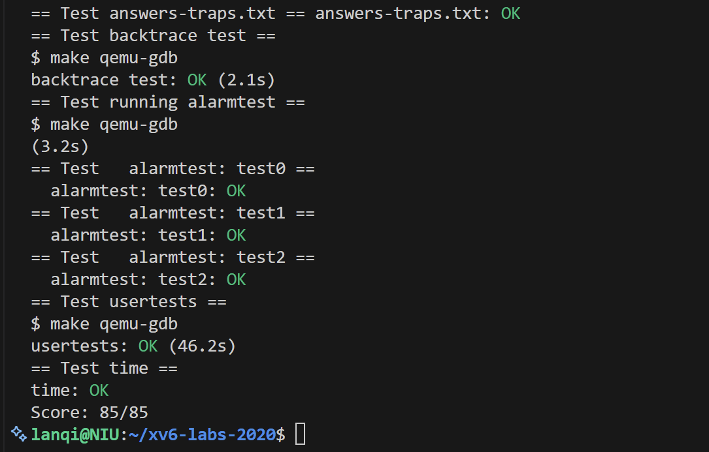

**问题与解决**

1. RISC-V 汇编代码不容易理解

刚开始阅读 `user/call.asm` 时，对函数参数、返回地址以及函数调用过程不熟悉，难以确定 C 语言代码与汇编指令之间的对应关系。通过查阅，了解到 `a0～a7` 用于传递参数，其中 `a0` 和 `a1` 也用于保存返回值；`ra` 保存函数返回地址；`sp` 和 `s0` 分别作为栈指针和帧指针。同时结合 C 源码逐条分析 `call.asm`，理解了 `jal`、`jalr` 等指令的作用。对于没有找到的函数调用，则通过反汇编结果判断其可能已被编译器内联。

2. 报警函数执行后程序崩溃

最初只在定时器到期时将：

```
p->trapframe->epc
```

修改为报警处理函数的地址。虽然能够打印 `alarm!`，但处理函数结束后无法恢复原程序，导致程序崩溃或测试失败。原因是报警处理函数会修改 `epc`、`ra`、`sp`、`a0` 等寄存器。解决方法是在跳转到处理函数之前备份整个 `trapframe`，而不是只保存 `epc`。当处理函数调用 `sigreturn()` 时，再恢复完整的陷阱帧，使程序能够从被中断的位置继续执行。

**实验心得**

通过本次实验，我对 xv6 从用户态进入内核态，再返回用户态的完整过程有了更加直观的认识。RISC-V 汇编练习让我理解了参数寄存器、返回地址等之间的关系，在实现 `backtrace()` 的过程中，我认识到高级语言中的函数调用在底层表现为严格的寄存器保存和栈帧组织。`Alarm` 实验则将系统调用、定时器中断和陷阱帧恢复联系到了一起。处理函数并不是普通的函数调用，而是内核通过修改 `epc` 强制改变用户程序的执行位置。要让程序在处理结束后继续正常运行，必须完整保存和恢复处理器现场，同时考虑周期触发和防止重入等问题。


------

## Lab: xv6 lazy page allocation

### Eliminate allocation from sbrk()

**要求：**

修改 xv6 的 `sbrk()` 系统调用，使其在扩大进程堆空间时只更新进程地址空间大小 `p->sz`，不立即分配物理内存或建立页表映射。随后运行程序并观察首次访问未映射内存时产生的缺页异常，为后续实现缺页处理和真正的惰性内存分配做准备。

**解决：**

1. 切换到 `lazy` 分支

```bash
git checkout lazy
```

2. 修改 `sys_sbrk()`

在`kernel/sysproc.c`中删除立即分配逻辑，`sys_sbrk`变为：

```c
uint64 sys_sbrk(void)
{
  uint64 addr;
  int n;
  struct proc *p =myproc();

  if(argint(0, &n) < 0)
    return -1;

  addr = p->sz;
  p->sz=p->sz+n;

  return addr;
}
```

此时只是扩大了进程的逻辑地址范围，并没有为新区域分配物理页。

这时会出错，出错的原因是（就题目示例而言）：`sbrk()` 扩大了 `p->sz`，所以 `0x4008` 在进程申请的合法范围内；但没有为它分配物理页并建立页表映射，因此写入该地址时产生 `scause=15` 的 store page fault。`stval=0x4008` 指明了发生缺页的虚拟地址，而 `sepc=0x1258` 指明了触发缺页的用户指令地址。

### Lazy allocation

**要求：**

修改 xv6 的用户陷阱处理逻辑，使内核能够识别用户态产生的读、写缺页异常，并根据故障地址按需分配和清零物理页，再建立对应的页表映射，使进程返回用户态后继续执行。同时修改页面释放逻辑，使其能够跳过尚未映射的懒分配页面。实现缺页异常处理、物理页分配、虚拟地址对齐和页表映射。

**解决：**

在上一题的基础上进行修改：

1. 实现`usertrap()` 的缺页处理

在`kernel/trap.c`中添加：

```c
else if(r_scause()==15||r_scause()==13)
{
    //scause = 13：Load page fault，读取未映射页面
    //scause = 15：Store/AMO page fault，写入未映射页面
    uint64 va = PGROUNDDOWN(r_stval());

    if(va >= p->sz || va >= MAXVA){
        p->killed = 1;
    }
    else{
        char *mem = kalloc();
        if(mem == 0){
            p->killed=1;
        }
        else{
            memset(mem, 0, PGSIZE);
            if(mappages(p->pagetable, va, PGSIZE, (uint64)mem, PTE_W|PTE_X|PTE_R|PTE_U) != 0){
                kfree(mem);
                p->killed=1;
            }
        }
    }
}
```

实现识别缺页异常，分配物理页，建立用户页表映射等。

2. 修改 `uvmunmap()`

将`kernel/vm.c`的`uvmunmap()`中原来遇到未映射页面便 panic 的代码修改为跳过未映射页面：

```c
if ((pte = walk(pagetable, a, 0)) == 0)
  continue;
if ((*pte & PTE_V) == 0)
  continue;
```

### Lazytests and Usertests

**要求：**

完善 xv6 的懒分配机制，使其能够正确处理负数 `sbrk()`、非法地址缺页、用户栈保护页、`fork()`中的父进程到子进程的内存复制、系统调用访问尚未分配的用户内存以及物理内存不足等情况。最终保证 `lazytests` 和 `usertests` 的所有测试均能通过。

**解决：**

这个实验主要是要处理一些特殊情况：

1. 修改 `sys_sbrk()` 使其支持负数参数

在 `kernel/sysproc.c` 中修改 `sys_sbrk()`：

```c
if(n<0){
    if(growproc(n)<0)
        return -1;
}
else{
    p->sz=p->sz+n;
}
```

其中：

- `n > 0`：只增大 `p->sz`，保持懒分配；
- `n < 0`：调用 `growproc()` 释放已经实际分配的页面。

2. 封装懒分配函数

在上一个实验中，把懒分配的代码直接写在 `usertrap()` 中，但是为了更加方便的使用，把它单独封装成一个函数。

在`kernel/vm.c`中加入懒分配实现函数，并在 `defs.h` 中添加声明：

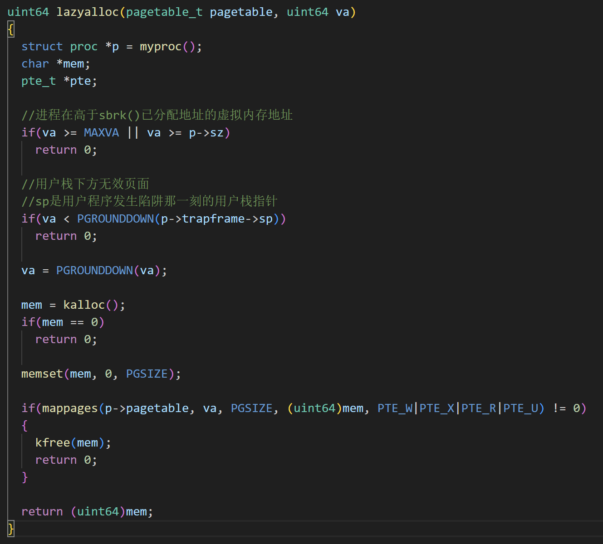

该函数负责：

- 检查地址是否超过 `sbrk()` 申请范围；
- 拒绝用户栈下方的保护页；
- 分配并清零物理页；
- 建立用户页表映射。

3. 简化 `usertrap()` 的缺页处理，让缺页处理调用 `lazyalloc()`

在 `kernel/trap.c` 的 `usertrap()` 中添加：

```c
else if(r_scause()==15||r_scause()==13)
{
    //scause = 13：Load page fault，读取未映射页面
    //scause = 15：Store/AMO page fault，写入未映射页面
    uint64 va = r_stval();

    if(lazyalloc(p->pagetable, va)==0)
      p->killed=1;
}
```

4. 修改 `uvmcopy()` 跳过页表空洞

在 `kernel/vm.c` 的 `uvmcopy()` 中，将：

```c
if((pte = walk(old, i, 0)) == 0)
	panic("uvmcopy: pte should exist");
if((*pte & PTE_V) == 0)
	panic("uvmcopy: page not present");
```

改为：

```c
if((pte = walk(old, i, 0)) == 0)
	continue;
if((*pte & PTE_V) == 0)
	continue;
```

这样 `fork()` 时：

- 已经分配的页面正常复制；
- 尚未分配的懒分配页面继续保持为空；
- 子进程首次访问空洞时自行触发缺页异常。

5. 修改 `copyout()` 支持懒分配地址

在 `kernel/vm.c` 的 `copyout()` 改为：

```c
pa0 = walkaddr(pagetable, va0);

if (pa0 == 0) {
  if (lazyalloc(pagetable, va0) == 0)
    return -1;

  pa0 = walkaddr(pagetable, va0);
  if (pa0 == 0)
    return -1;
}
```

这样 `read()` 可以把数据写入由 `sbrk()` 申请但尚未实际分配的用户缓冲区。

6. 修改 `copyin()` 支持懒分配地址

 `copyin()` 改为：

```c
pa0 = walkaddr(pagetable, va0);

if (pa0 == 0) {
  if (lazyalloc(pagetable, va0) == 0)
    return -1;

  pa0 = walkaddr(pagetable, va0);
  if (pa0 == 0)
    return -1;
}
```

这样内核可以从合法但尚未分配的用户页面读取数据。

7. 修改 `copyinstr()` 支持懒分配地址

`copyinstr()` 改为：

```c
pa0 = walkaddr(pagetable, va0);

if (pa0 == 0) {
  if (lazyalloc(pagetable, va0) == 0)
    return -1;

  pa0 = walkaddr(pagetable, va0);
  if (pa0 == 0)
    return -1;
}
```

这样系统调用读取用户字符串时，也能处理尚未实际分配的合法地址。

### Lab总结

**实验结果：**

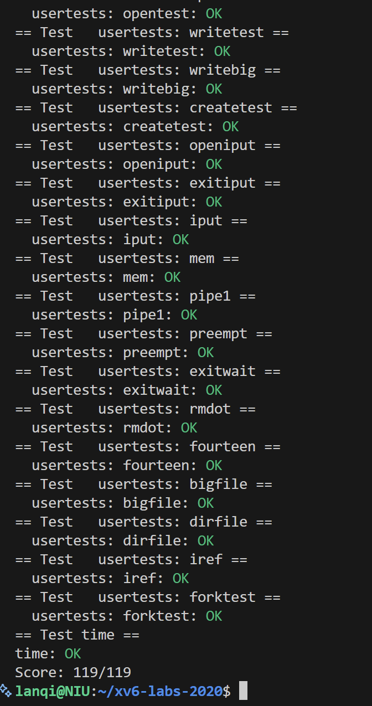

**问题与解决**

1. `fork()` 遇到未映射页面时失败

原来的 `uvmcopy()` 假定从地址0到 `p->sz` 的所有页面都存在映射。懒分配后，地址空间中可能存在空洞，导致 `fork()` 时出现 panic。为了解决这个问题，修改 `uvmcopy()`，遇到不存在或无效的 PTE 时直接跳过。父进程已经分配的页面正常复制，未分配的页面在子进程中继续保持未映射，等子进程真正访问时再分配。

2. 系统调用无法访问懒分配内存

用户程序可能将 `sbrk()` 返回的地址直接传给 `read()` 或 `write()`。此时页面尚未映射，而访问发生在内核的 `copyin()`、`copyout()` 或 `copyinstr()` 中，不会经过用户态的 `usertrap()`。为了解决这个问题，在这些复制函数中，当 `walkaddr()` 找不到映射时，主动调用懒分配函数建立页面映射，然后重新查询物理地址并完成数据复制。

**实验心得**

通过本次实验，我理解了懒分配并不是简单地推迟一次 `kalloc()`，而是会改变内核对进程地址空间的基本假设。以前 `p->sz` 范围内的页面默认都已经映射；引入懒分配后，合法地址空间中允许存在尚未映射的空洞，因此页表复制、页面释放和内核访问用户内存的逻辑都需要同步调整。

本实验也让我更清楚地理解了缺页异常的处理过程：CPU 保存故障指令和地址，内核根据 `scause` 与 `stval` 判断异常原因，分配并映射页面后保持 `epc` 不变，使原指令重新执行。这个过程体现了虚拟内存硬件和操作系统内核之间的配合。

此外，实验说明了地址合法与页面已映射是两个不同概念。一个地址可以位于 `p->sz` 范围内，但尚未对应物理内存；也可能发生缺页异常，却属于越界访问或栈保护页，不能进行分配。只有正确完成边界判断、错误回收和内存不足处理，懒分配机制才能安全运行。


------

## Lab: Copy-on-Write Fork for xv6

### Implement copy-on write

**要求：**

为 xv6 实现写时复制（Copy-on-Write，COW）版本的 `fork()`。父子进程创建时共享相同的物理页面，并将相关页表项设为只读和 COW；当任一进程尝试写入共享页面时，内核通过缺页异常分配并复制新页面。还需使用引用计数管理共享物理页，并让 `copyout()` 正确处理 COW 页面，最终通过 `cowtest` 和 `usertests`。

**解决：**

1. 切换到 `cow` 分支

```c
git checkout cow
```

2. 添加 COW 页表标志

在 `kernel/riscv.h` 的 PTE 标志区域添加：

```c
c#define PTE_COW (1L << 8)
```

因为第8位属于 RISC-V 页表项中的软件保留位，可由内核用于标记 COW 页面。

3. 为物理页添加引用计数

在 `kernel/kalloc.c` 中添加：

```c
struct {
  struct spinlock lock;
  int count[PHYSTOP / PGSIZE];
} refcnt;
```

引用计数用于记录每个物理页当前被多少个页表引用。

4. 初始化引用计数锁

在 `kinit()` 中添加：

```c
initlock(&refcnt.lock, "refcnt");
```

5. 修改空闲内存初始化

在 `freerange()` 中，调用 `kfree()` 前先将引用计数设置为1：

```c
for (; p + PGSIZE <= (char *)pa_end;
     p += PGSIZE) {
  refcnt.count[(uint64)p / PGSIZE] = 1;
  kfree(p);
}
```

因为修改后的 `kfree()` 会先将引用计数减1，使初始化页面的计数从1变为0，再放入空闲链表。

6. 修改 `kalloc()`

在 `kernel/kalloc.c` 的 `kalloc()` 中，将新分配页面的引用计数设置为1：

```c
if (r) {
  memset((char *)r, 5, PGSIZE);

  acquire(&refcnt.lock);
  refcnt.count[(uint64)r / PGSIZE] = 1;
  release(&refcnt.lock);
}
```

7. 修改 `kfree()`

让 `kfree()` 先减少引用计数，只有计数变成0时才真正释放页面：

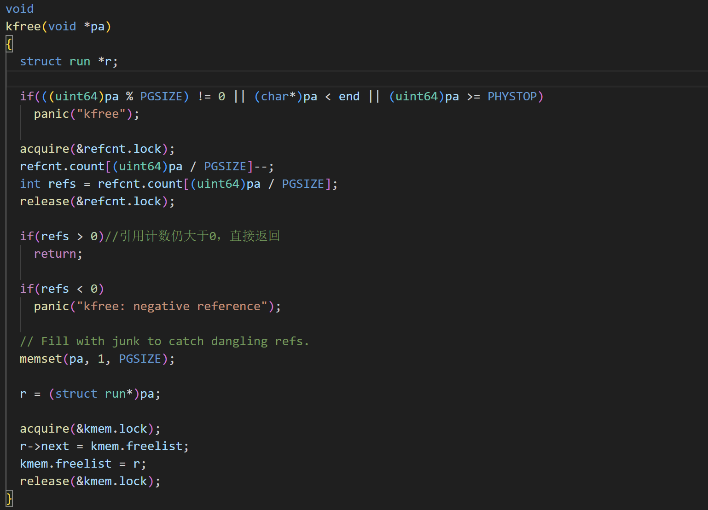

8. 添加增加引用计数的函数

在 `kernel/kalloc.c` 中添加：

```c
//增加引用计数的函数
void kaddref(uint64 pa)
{
  if(pa >= PHYSTOP || pa % PGSIZE != 0)
    panic("kaddref");

  acquire(&refcnt.lock);
  refcnt.count[pa / PGSIZE]++;
  release(&refcnt.lock);
}
```

并在 `kernel/defs.h` 中声明：

```c
void kaddref(uint64);
```

9. 修改 `uvmcopy()` 共享物理页

在 `kernel/vm.c` 中修改 `uvmcopy()`，取消为子进程分配和复制物理页：

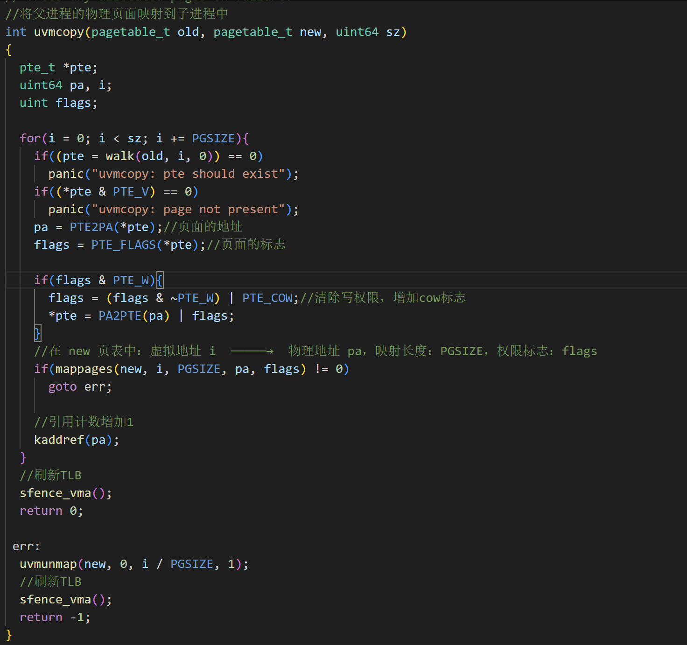

这会：

- 让父子进程共享相同物理页；
- 清除原本可写页面的 `PTE_W`；
- 为其添加 `PTE_COW`；
- 增加共享物理页的引用计数。

10. 声明 COW 缺页处理函数

在 `kernel/defs.h` 的 `vm.c` 声明区域添加：

```c
int cowalloc(pagetable_t, uint64);
```

11. 实现 `cowalloc()`

在 `kernel/vm.c` 中添加：

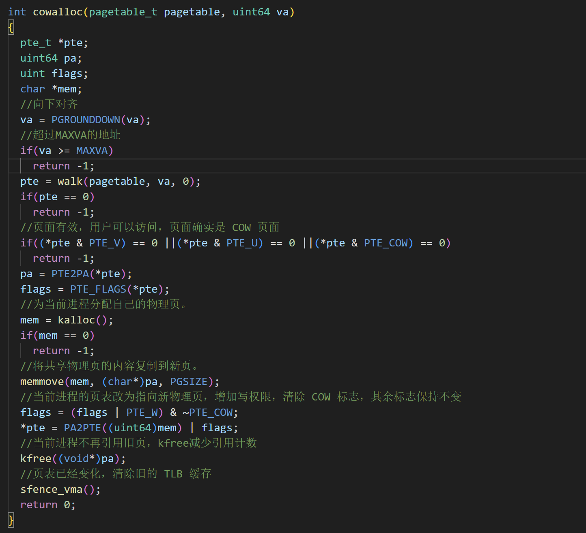

该函数会为发生写异常的进程分配新物理页，复制原页面内容，并将新页面设置为可写。

12. 在 `usertrap()` 中处理 COW 写异常

在 `kernel/trap.c` 的 `usertrap()` 中添加：

```c
else if(r_scause()==15){
    uint64 va = r_stval();
    if(va >= p->sz || cowalloc(p->pagetable, va) < 0)
        p->killed = 1;
}
```

`scause == 15` 表示 `Store/AMO page fault`。

如果地址非法、页面不是 COW 页面或新页面分配失败，则终止当前进程。

13. 修改 `copyout()` 处理 COW 页面

修改 `kernel/vm.c` 的 `copyout()` ，因为`copyout()` 在内核中直接写物理内存，不会触发用户态写异常，因此必须主动处理 COW 页面。

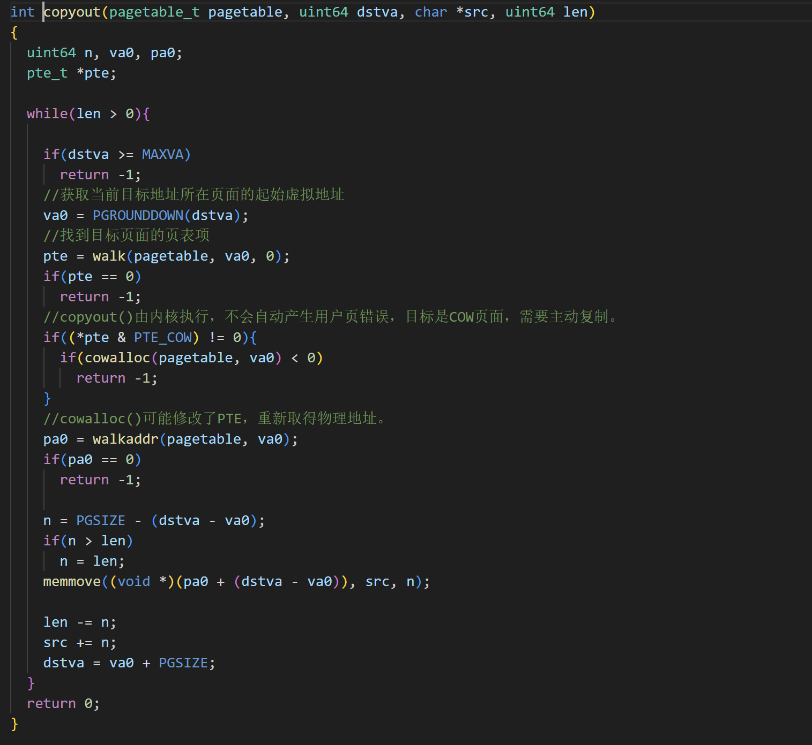

### Lab总结

**实验结果：**

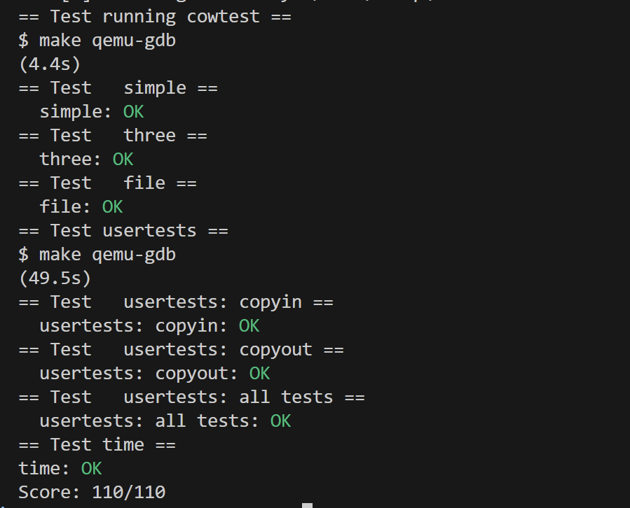

**问题与解决**

1. 修改 PTE 后仍使用旧权限

修改父进程页表项后，CPU 的 TLB 中可能仍保存旧的可写映射，导致写操作不触发 COW 缺页异常。为了解决这一问题，修改页表项后调用 `sfence_vma()`，刷新 TLB 中缓存的地址转换结果。

2. `copyout()` 破坏父子进程的数据隔离

`copyout()` 在内核态直接向用户物理页写入数据，不会触发用户态缺页异常。如果目标是 COW 页面，内核可能直接修改父子进程共享的物理页。为了解决这个问题，在 `copyout()` 中检查目标 PTE 是否带有 `PTE_COW`。如果是，先调用 COW 处理函数完成页面复制，再向新的物理页写入数据。

然而，`copyin()` 和 `copyinstr()` 只读取用户页面，不会修改共享数据，因此不需要进行 COW 复制。COW 的基本原则是：共享读取是安全的，共享写入必须先复制。

**实验心得**

通过本次实验，我进一步理解了虚拟内存和页表提供的间接映射能力。写时复制并不是在 `fork()` 时立即复制进程内存，而是先让父子进程共享物理页，只有某个进程真正写入时才分配并复制页面。这种方式减少了不必要的内存分配和数据复制，尤其适合子进程随后立即调用 `exec()` 的情况。

实验也让我认识到，COW 并不只是修改 `uvmcopy()`。一个完整实现还需要同时考虑页表权限、缺页异常、TLB 刷新、物理页引用计数、进程退出以及 `copyout()` 等内核写用户内存的特殊路径。任何一个环节处理不当，都可能造成数据相互影响、内存泄漏、重复释放或内核崩溃。此外，引用计数让我更清楚地理解了共享资源的生命周期管理：页面是否能够释放，不能只取决于当前进程是否结束，而应取决于是否仍有其他页表引用它。


------

## Lab: Multithreading

### Uthread: switching between threads

**要求：**

完善 xv6 的用户级线程库，实现线程创建和线程上下文切换。每个线程需要拥有独立的栈和寄存器上下文；调度时保存当前线程的被调用者保存寄存器，并恢复下一个线程的寄存器，使线程能够从上次暂停的位置继续运行。实现线程调度、RISC-V 调用约定、栈初始化和汇编上下文切换。

**解决：**

1. 切换到 `thread` 分支

```
git checkout thread
```

2. 为线程添加寄存器上下文

在 `user/uthread.c` 中添加：

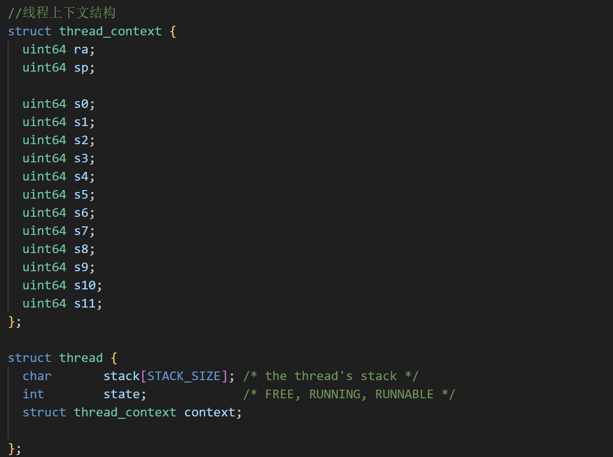

3. 声明线程切换函数

在 `user/uthread.c` 中修改声明，便于理解，第一个参数表示需要保存的旧线程上下文，第二个参数表示需要恢复的新线程上下文。

```c
extern void thread_switch(struct thread_context *,struct thread_context *);
```

4. 初始化新线程上下文

在 `user/uthread.c` 的`thread_create`中添加：

```c
t->context.ra = (uint64)func;
t->context.sp = (uint64)t->stack + STACK_SIZE;
```

其中：

- `ra` 指向线程入口函数；
- `sp` 指向线程独立栈的顶部。

新线程第一次被调度时，`thread_switch()` 最后的 `ret` 会跳转到 `func()`。

5. 在调度器中切换线程

在 `thread_schedule()` 中添加：

```c
thread_switch(&t->context,&next_thread->context);
```

6. 实现汇编上下文切换

在 `user/uthread_switch.S` 中模仿`swtch.S`添加：

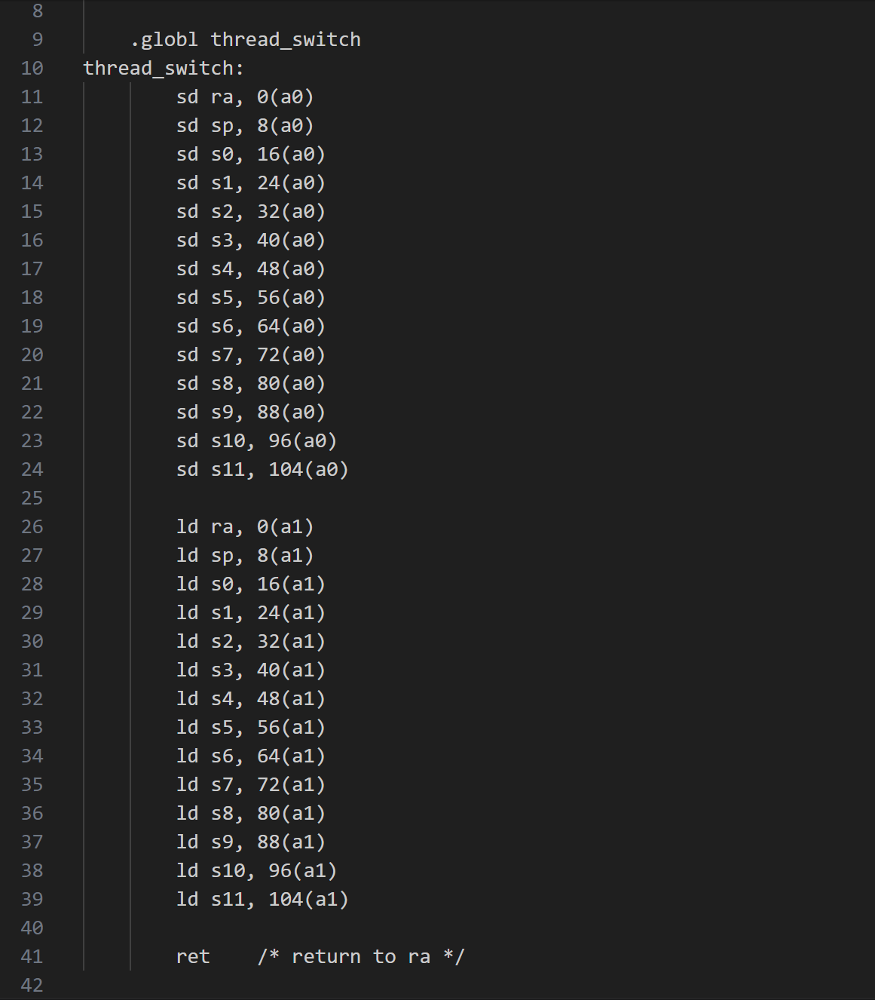

### Using threads

**要求：**

这个题目要求使用 Linux/macOS 的 POSIX 线程和互斥锁修复多线程哈希表中的竞态条件，分析并记录并发插入导致键丢失的原因。先通过加锁保证两线程运行时没有键丢失，再为每个哈希桶设置独立锁，使不同桶的插入操作能够并行执行，在保证正确性的同时获得至少 1.25 倍的并行加速。最终通过 `ph_safe` 和 `ph_fast` 测试。

**解决：**

1. 运行原始程序

在 xv6 项目根目录执行：

```
make ph
./ph 1
./ph 2
```

单线程没有键丢失，而双线程会出现`keys missing`：

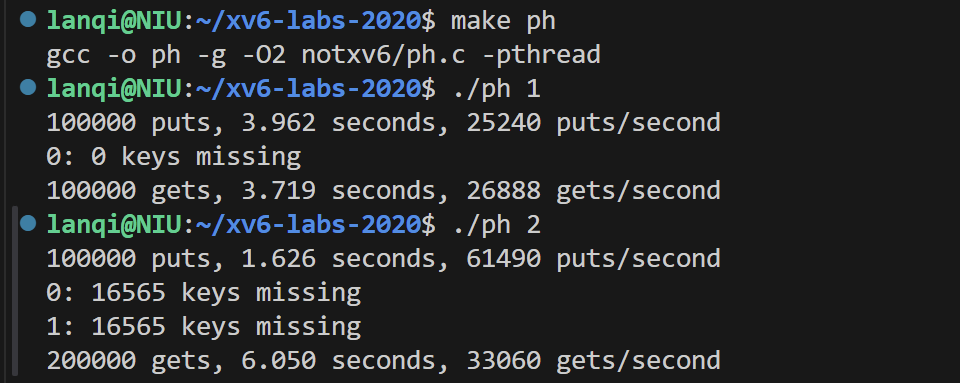

在项目根目录创建并填写 `answers-thread.txt` ：

如果使用两个线程时，两个线程可能同时向哈希表的同一个桶中插入元素，从而发生竞态条件并造成更新丢失。
假设 table[i] 原来指向节点 E。线程 1 要插入节点 A，线程 2 要插入节点 B，可能发生以下执行顺序：
1. 线程 1 读取 table[i]，得到 E。
2. 线程 2 也读取 table[i]，得到 E。
3. 线程 1 设置 A->next = E。
4. 线程 2 设置 B->next = E。
5. 线程 1 设置 table[i] = A。
6. 线程 2 设置 table[i] = B。

最后链表变成 table[i] -> B -> E，而节点 A 不再能从 table[i] 访问到。线程 2 对桶头指针的写入覆盖了线程 1 的写入，因此 A 对应的 key 丢失。
而使用一个线程时，插入操作按顺序执行，不会出现两个线程同时读取和修改同一个桶头指针的情况，因此不会发生这种更新覆盖，也就不会丢失 key。

2. 先添加全局锁保证正确性

在 `notxv6/ph.c` 的全局变量区域添加：

```c
pthread_mutex_t lock;
```

在 `main()` 创建线程之前初始化：

```c
pthread_mutex_init(&lock, NULL);
```

使用全局锁保护 `put()`：

在 `put()` 的查找和修改操作外加锁，锁覆盖查找、判断和插入的完整过程。

```c
pthread_mutex_lock(&lock);
pthread_mutex_unlock(&lock);
```

使用全局锁保护 `get()`

在 `get()` 中添加：

```c
pthread_mutex_lock(&lock);
pthread_mutex_unlock(&lock);
```

此时运行：

```
make ph
./ph 1
./ph 2
```

显示：

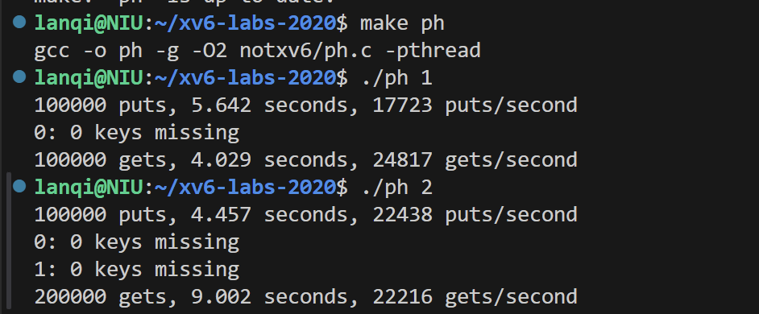

全局锁可以保证正确性，但所有线程都竞争同一把锁，所以无法通过 `ph_fast` 性能测试。

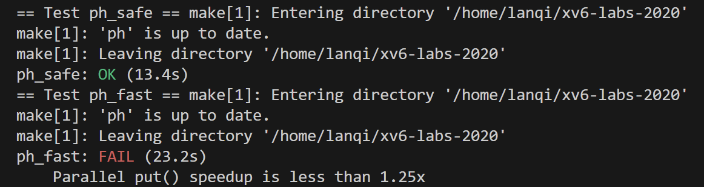

3. 将全局锁改为桶锁数组

删除：

```c
pthread_mutex_t lock;
```

改为：

```c
pthread_mutex_t locks[NBUCKET];
```

每个哈希桶使用一把独立的互斥锁。

初始化所有桶锁

在 `main()` 创建线程之前添加：

```c
for (int i = 0; i < NBUCKET; i++){
	pthread_mutex_init(&locks[i], NULL);
}
```

使用桶锁保护 `put()`:

将全局锁替换为当前桶对应的锁：

```c
pthread_mutex_lock(&locks[i]);
pthread_mutex_unlock(&locks[i]);
```

访问同一个桶的线程会互斥，而访问不同桶的线程可以并行运行。

使用桶锁保护 `get()`：

在 `get()` 中使用相同的桶锁：

```c
pthread_mutex_lock(&locks[i]);
pthread_mutex_unlock(&locks[i]);
```

`put()` 和 `get()` 必须对同一个桶使用同一把锁。

再次测试：

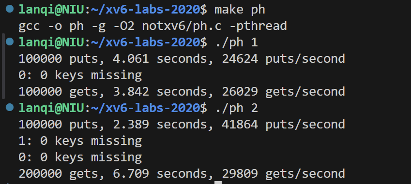

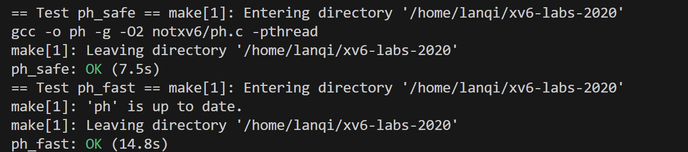

### Barrier

**要求：**

使用互斥锁和条件变量实现可重复使用的线程屏障，使每一轮中所有参与线程都到达屏障后才能继续执行。需要正确维护到达线程数和轮次，使用 `pthread_cond_wait()` 阻塞未满足条件的线程，并使用 `pthread_cond_broadcast()` 唤醒所有等待线程，同时避免不同轮次之间相互干扰，最终通过 `barrier` 测试。

**解决：**

1. 确认屏障初始化

模板提供的 `barrier_init()` 中有：

```c
static void
barrier_init(void)
{
  assert(pthread_mutex_init(&bstate.barrier_mutex, NULL) == 0);//初始化互斥锁
  assert(pthread_cond_init(&bstate.barrier_cond, NULL) == 0);//初始化条件变量
  bstate.nthread = 0;
}
```

互斥锁、条件变量、到达人数和轮次必须在创建线程之前初始化。

2. 补全 `barrier()` 

 `notxv6/barrier.c` 的 `barrier()` 改为：

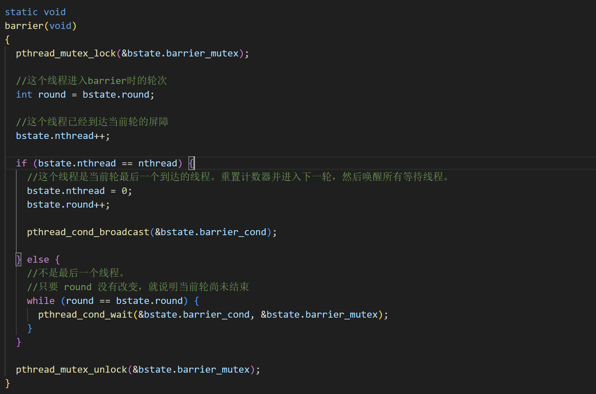

### Lab总结

**实验结果：**

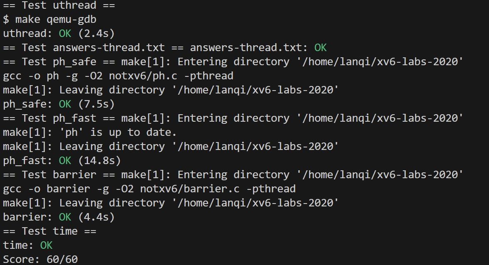

**问题与解决**

1. Uthread：用户级线程切换

在实现用户级线程时，最初线程无法正常启动或在切换几次后发生异常。主要原因是新线程没有正确初始化执行入口和独立栈，同时线程切换时保存的寄存器不完整。

解决方法是为每个线程增加独立的上下文结构。线程切换时需要保存`ra`、`sp`、`s0～s11`，不需要保存`a0～a7`、`t0～t6`，因为根据 RISC-V 调用约定，`a` 和 `t` 寄存器属于调用者保存寄存器，调用者本来就不能假设它们在函数调用后保持不变；`s0～s11` 属于被调用者保存寄存器，切换函数必须保存和恢复它们。除此之外，还必须保存 `ra` 和 `sp`，否则线程无法恢复原来的执行位置和独立栈。

创建线程时，将 `ra` 设置为线程函数地址，将 `sp` 设置为线程栈顶；切换线程时，在汇编函数中保存旧线程上下文并恢复新线程上下文。

2. 线程屏障部分线程提前进入下一轮

屏障的主要问题是部分线程会提前进入下一轮，导致不同线程的循环轮次不一致并触发断言错误。只使用到达线程计数器仍然无法区分前后两轮，快速线程可能在其他线程尚未完全离开上一轮时修改下一轮的计数。

解决方法是使用互斥锁保护共享状态，并同时维护 `nthread` 和 `round`。线程进入屏障时保存当前轮次并增加到达人数；最后一个到达的线程清零计数器、增加轮次，并使用 `pthread_cond_broadcast()` 唤醒所有等待线程；其他线程通过 `pthread_cond_wait()` 等待轮次发生变化。

**实验心得**

通过本次实验，我进一步理解了线程创建、上下文切换、互斥同步和条件变量的工作原理。用户级线程切换让我认识到，线程的运行状态本质上由寄存器上下文和栈共同决定，恢复 `ra` 和 `sp` 就能够让线程从原来的位置继续执行。哈希表实验说明，多线程程序即使单线程运行完全正确，在并发环境下也可能因为操作交错产生竞态条件。加锁不仅要考虑正确性，还需要合理控制锁的粒度。全局锁实现简单但限制并行性，而分桶锁能在保证数据安全的同时提高性能。屏障实验让我进一步理解了互斥锁和条件变量。

总体而言，本次实验让我认识到，并发程序的难点不仅是让多个线程同时运行，更重要的是正确管理共享状态、线程执行顺序和同步范围。


------

## Lab: locks

### Memory allocator

**要求：**

重新设计 xv6 的物理内存分配器，为每个 CPU 建立独立的空闲页链表和锁，使不同 CPU 能够并行执行 `kalloc()` 和 `kfree()`，减少对单一 `kmem` 锁的竞争。当当前 CPU 的空闲链表为空时，需要从其他 CPU 的链表中窃取空闲页。所有相关锁名必须以 `kmem` 开头，最终通过 `kalloctest`、`usertests sbrkmuch` 和完整的 `usertests`。

**解决：**

1. 切换到 `lock` 分支

```
git checkout lock
```

2. 将全局空闲链表改为每 CPU 一条链表

在 `kernel/kalloc.c` 中，将：

```c
struct {
  struct spinlock lock;
  struct run *freelist;
} kmem;
```

修改为：

```c
struct {
  struct spinlock lock;
  struct run *freelist;
} kmem[NCPU];
```

3. 初始化每个 CPU 的锁和空闲链表

修改 `kinit()`：

```c
void kinit()
{
  for(int i=0;i<NCPU;i++){
    initlock(&kmem[i].lock, "kmem");
    kmem[i].freelist = 0;
  }
  freerange(end, (void*)PHYSTOP);//通过kfree()把初始空闲页加入当前CPU的链表
}
```

4. 在 `kfree()` 中获取当前 CPU 编号

根据提示，由于 `cpuid()` 只能在关闭中断时安全使用，因此通过：

```c
push_off();
int id = cpuid();
```

获得当前 CPU 编号，操作完成后再调用：

```c
pop_off();
```

5. 修改 `kfree()`

将释放的物理页加入当前 CPU 的空闲链表：

```c
//释放页时，页会进入当前CPU的空闲链表
push_off();
int id = cpuid();

acquire(&kmem[id].lock);
r->next = kmem[id].freelist;
kmem[id].freelist = r;
release(&kmem[id].lock);

pop_off();
```

6. 实现偷页

在 `kernel/kalloc.c` 中修改 `kalloc()`：

先从当前 CPU 的链表获取页面；如果链表为空，则从其他 CPU 偷取：

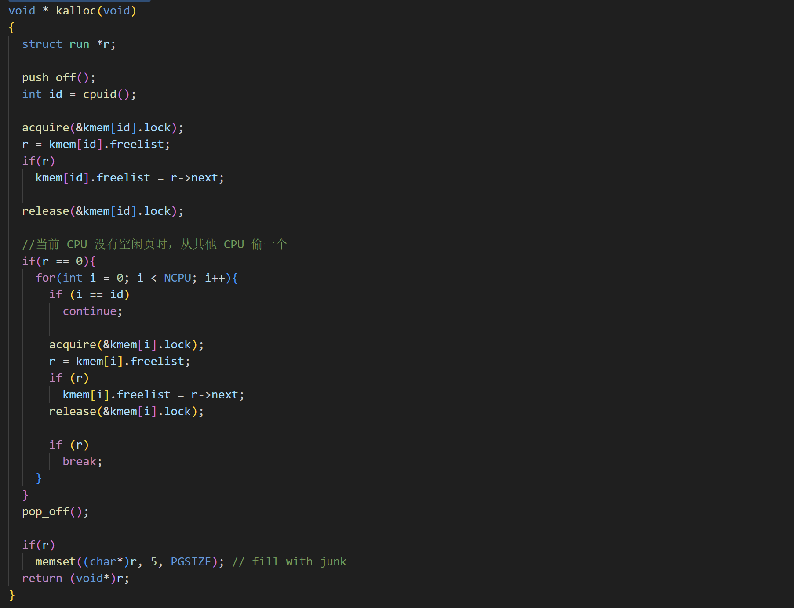

### Buffer cache

**要求：**

重新设计 xv6 的磁盘块缓存，使用哈希表组织缓存块，并为每个哈希桶设置独立锁，使不同磁盘块的查找和释放能够并行执行，降低 `bcache.lock` 的竞争。同时需要保证同一磁盘块在缓存中最多只有一个副本，并正确处理缓存未命中、LRU 缓存替换、跨桶移动和多锁死锁问题。所有相关锁名必须以 `bcache` 开头，最终通过 `bcachetest`、`usertests` 和 `make grade`。

**解决：**

1. 在缓冲区结构中添加时间戳和桶编号

修改 `kernel/buf.h` 的 `struct buf` ：

```c
struct buf {
  int valid;   // has data been read from disk?
  int disk;    // does disk "own" buf?
  uint dev;    //磁盘设备编号
  uint blockno;  //磁盘块编号
  struct sleeplock lock;
  uint refcnt;     //有多少使用者在使用该缓冲区
  struct buf *prev; // LRU cache list
  struct buf *next;
  uchar data[BSIZE];
  uint timestamp;   //refcnt变成0时记录最后使用时间
  int bucket;   //桶号
};
```

2. 将全局缓存链表改为哈希桶

在 `kernel/bio.c` 中定义13个哈希桶：

```c
#define NBUCKET 13

struct bucket{
  struct spinlock lock;
  struct buf head;
};
```

然后修改 `bcache`：

```c
struct {
  //串行化缓存未命中后的淘汰过程
  struct spinlock lock;
  struct buf buf[NBUF];

  struct bucket buckets[NBUCKET];
} bcache;
```

3. 声明系统时钟并添加哈希函数

在 `kernel/bio.c` 中添加：

```c
extern uint ticks;
```

然后添加：

```c
static int
bhash(uint blockno)
{
  return blockno % NBUCKET;
}
```

4. 添加桶链表操作函数

在 `kernel/bio.c` 中添加插入函数：

```c
static void
binsert(struct bucket *bucket, struct buf *b)
{
  b->next = bucket->head.next;
  b->prev = &bucket->head;

  bucket->head.next->prev = b;
  bucket->head.next = b;
}
```

再添加删除函数：

```c
static void
bremove(struct buf *b)
{
  b->prev->next = b->next;
  b->next->prev = b->prev;
}
```

5. 修改 `binit()`

初始化全局淘汰锁和所有哈希桶：

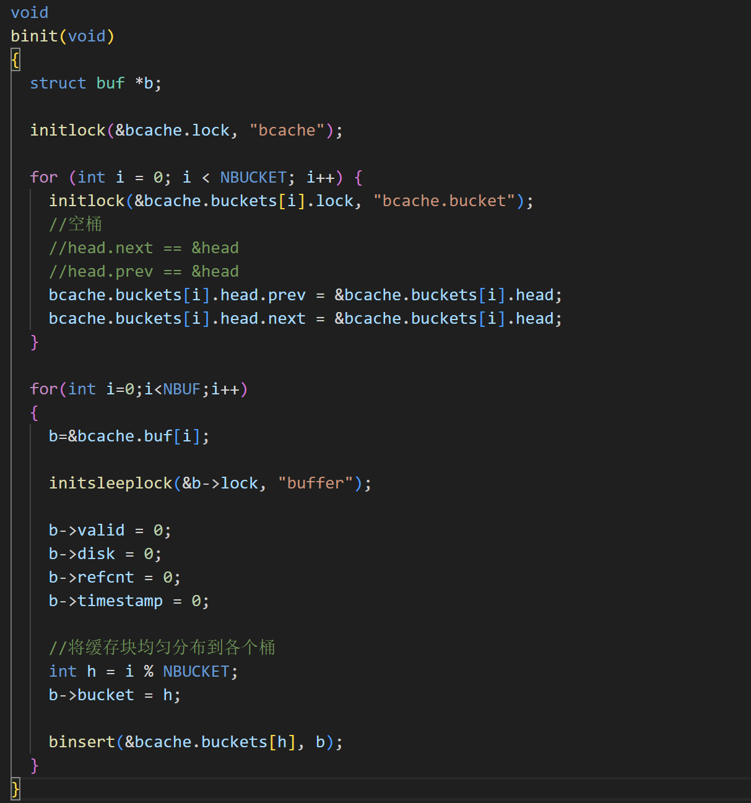

6. 修改 `bget()` 

```c
static struct buf*
bget(uint dev, uint blockno)
{
  struct buf *b;
  struct buf *victim;
  int h;

  h=bhash(blockno);//计算目标桶

  //目标桶里查找
  acquire(&bcache.buckets[h].lock);

  // Is the block already cached?
  //循环双向链表
  for(b = bcache.buckets[h].head.next; b != &bcache.buckets[h].head; b = b->next){
    if(b->dev == dev && b->blockno == blockno){
      b->refcnt++;
      release(&bcache.buckets[h].lock);
      acquiresleep(&b->lock);
      return b;
    }
  }

  release(&bcache.buckets[h].lock);

  // Not cached.
  // Recycle the least recently used (LRU) unused buffer.
  //缓存未命中时获取全局锁
  //保证同一时刻只有一个线程执行缓存淘汰
  acquire(&bcache.lock);

  //再次检查，防止第一次查找失败到获取 bcache.lock 之间，其他线程已经把这个磁盘块加入缓存

  acquire(&bcache.buckets[h].lock);

  for (b = bcache.buckets[h].head.next;b != &bcache.buckets[h].head;b = b->next) {
    if (b->dev == dev && b->blockno == blockno){
      b->refcnt++;
      release(&bcache.buckets[h].lock);
      release(&bcache.lock);

      acquiresleep(&b->lock);
      return b;
    }
  }

  release(&bcache.buckets[h].lock);

  //选择 refcnt == 0 且 timestamp 最小的缓存块。
  
retry_victim:

  victim = 0;
  uint oldest = (uint)-1;

  for (int i = 0; i < NBUF; i++)
  {
    b = &bcache.buf[i];

    int bh = b->bucket;

    acquire(&bcache.buckets[bh].lock);

    if (b->refcnt == 0 &&(victim == 0 || b->timestamp < oldest)) {
      victim = b;
      oldest = b->timestamp;
    }
    release(&bcache.buckets[bh].lock);
  }

  //都有进程
  if (victim == 0)
  {
    release(&bcache.lock);
    panic("bget: no buffers");
  }

  //扫描期间普通的缓存命中仍可增加 victim->refcnt，重新获取 victim 所在桶的锁，并再次检查
  int oldh = victim->bucket;

  acquire(&bcache.buckets[oldh].lock);

  //重新检查 victim 是否仍然空闲
  if (victim->refcnt != 0) {
    release(&bcache.buckets[oldh].lock);
    goto retry_victim;
  }

  if (oldh == h)//旧块和新块映射到同一个桶，直接修改其身份
  {
    victim->dev = dev;
    victim->blockno = blockno;
    victim->valid = 0;
    victim->refcnt = 1;
    victim->timestamp = ticks;

    release(&bcache.buckets[oldh].lock);
  }
  else//victim要从旧桶移动到新桶
  {
    //当前持有旧桶锁。由于 bcache.lock 保证只有一个淘汰线程，而普通命中只会获取一把桶锁，所以这里获取新桶锁不会与另一个淘汰线程形成锁环。
    acquire(&bcache.buckets[h].lock);

    bremove(victim);

    victim->dev = dev;
    victim->blockno = blockno;
    victim->valid = 0;
    victim->refcnt = 1;
    victim->timestamp = ticks;
    victim->bucket = h;

    binsert(&bcache.buckets[h], victim);

    release(&bcache.buckets[h].lock);
    release(&bcache.buckets[oldh].lock);
  }

  release(&bcache.lock);

  //缓冲区缓存为每个缓冲区使用一把睡眠锁，确保任意时刻只有一条线程使用该缓冲区
  acquiresleep(&victim->lock);
  return victim;
}
```

7. 修改 `brelse()`

将原来的全局 LRU 链表操作改为只更新当前桶中的引用计数，并且当引用计数变为0时，记录释放时间，供之后选择最久未使用的缓冲区。

```c
void
brelse(struct buf *b)
{
  if(!holdingsleep(&b->lock))
    panic("brelse");

  releasesleep(&b->lock);

  int h =b->bucket;

  acquire(&bcache.buckets[h].lock);
  b->refcnt--;

  if (b->refcnt == 0) {
    b->timestamp=ticks;
  }
  release(&bcache.buckets[h].lock);
}
```

8. 修改 `bpin()`

```c
void
bpin(struct buf *b){
  int h = b->bucket;
  acquire(&bcache.bucket[h].lock);
  b->refcnt++;
  release(&bcache.bucket[h].lock);
}
```

9. 修改 `bunpin()`

```c
void
bunpin(struct buf *b){
  int h = b->bucket;

  acquire(&bcache.bucket[h].lock);
  if (b->refcnt < 1)
    panic("bunpin");
  b->refcnt--;
  if (b->refcnt == 0)
    b->timestamp = ticks;

  release(&bcache.bucket[h].lock);
}
```

### Lab总结

**实验结果：**

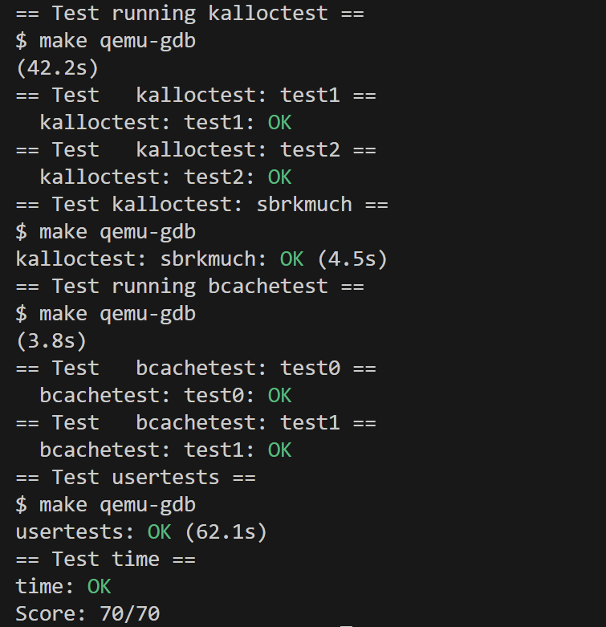

**问题与解决**

1. 可能为同一磁盘块建立多个缓存副本

两个进程可能同时第一次查找某个块，并且都发现缓存未命中。如果它们分别选择空闲缓冲区，就可能为相同的 `(dev, blockno)` 创建两个缓存副本，破坏块缓存的唯一性。为了避免发生这个问题，缓存未命中后先获取全局淘汰锁，然后再次查找目标哈希桶。只有第二次查找仍然失败时，才选择空闲缓冲区进行替换。全局锁保证同一时间只有一个线程执行缓存淘汰和新块创建。

2. 发生重复加锁

被替换缓冲区原来所在的桶可能与新块所在的桶相同。如果不区分这种情况，可能对同一把自旋锁重复执行 `acquire()`，从而触发错误。为了避免发生这种情况，分别处理 `oldh == h` 和 `oldh != h`：

- 如果新旧桶相同，直接在持有当前桶锁时修改缓存块信息；
- 如果新旧桶不同，则在全局淘汰锁的保护下完成删除、修改和插入操作。

**实验心得**

本次实验让我进一步理解了锁不仅用于保证程序正确性，也会直接影响多核程序的并行性能。即使程序不存在数据错误，如果大量操作都依赖同一把锁，多核处理器也会因为锁竞争退化为近似串行执行。

在物理内存分配器中，将一条全局空闲链表拆分为多条每 CPU 链表，本质上是通过数据分区减少共享状态。大多数内存操作只访问该 CPU 的链表，只有资源不足时才需要与其他 CPU 协调。这种方法能够兼顾性能和资源利用率。块缓存的实现更加复杂，因为磁盘块是真正需要在不同 CPU 和进程之间共享的数据，不能简单地为每个 CPU 保存独立副本。

实验还让我认识到，减小锁粒度会明显增加并发控制的复杂度。必须仔细考虑各种可能情况，避免出现死锁。

------

## Lab: file system

### Large files

**要求：**

题目要求扩展 xv6 文件系统的最大文件容量，在 inode 中保留11个直接块地址，并使用一个一级间接块和一个二级间接块。需要修改 inode 地址结构、`bmap()` 的块映射与按需分配逻辑，以及 `itrunc()` 的完整释放逻辑，同时保持磁盘 inode 大小不变，并确保内存 inode 与磁盘 inode 的地址数组一致。最终使 `bigfile` 能写入 65803 个数据块。

**解决：**

1. 切换到 `fs` 分支

```
git checkout fs
```

2. 修改直接块和间接块数量

在 `kernel/fs.h` 中进行修改：

```c
#define NDIRECT 11
#define NINDIRECT (BSIZE / sizeof(uint))
#define NDINDIRECT (NINDIRECT * NINDIRECT)
#define MAXFILE (NDIRECT + NINDIRECT + NDINDIRECT)
```

这样，最大文件块数会1变为：

```
11 + 256 + 256×256 = 65803
```

3. 修改磁盘 inode 地址数组

在 `kernel/fs.h` 的 `struct dinode` 中修改：

```c
uint addrs[NDIRECT + 2];
```

4. 修改内存 inode 地址数组

在 `kernel/file.h` 的 `struct inode` 中修改：

```
uint addrs[NDIRECT + 2];
```

让内存 inode 和磁盘 inode 的地址数组长度保持一致。

5. 修改 `bmap()` 的处理

`kernel/fs.c` 的 `bmap()` 作用是把文件内部的“逻辑块号”转换成磁盘上的“物理块号”；如果对应磁盘块还不存在，就分配一个新块。

修改逻辑为：

```c
static uint
bmap(struct inode *ip, uint bn)
{
  uint addr,*a;
  struct buf *bp;
  //直接块
  if(bn<NDIRECT){
    if((addr=ip->addrs[bn])==0)
      ip->addrs[bn]=addr=balloc(ip->dev);//在ip所属的磁盘上找一个空闲块，将其标记为已使用并清零，然后返回这个块的物理编号。
    return addr;
  }

  bn=bn-NDIRECT;

  //一级间接块
  if(bn<NINDIRECT){
    if((addr=ip->addrs[NDIRECT])==0)
      ip->addrs[NDIRECT]=addr=balloc(ip->dev);
    
     //把指定磁盘块读取到内存的缓冲区
    bp=bread(ip->dev,addr);
    //块内容看作地址数组
    a = (uint*)bp->data;

    // 如果对应的数据块不存在，就分配数据块
    if((addr = a[bn]) == 0){
      a[bn] = addr = balloc(ip->dev);
      log_write(bp);//告诉xv6日志系统，缓冲区bp已被修改，需要作为当前文件系统事务的一部分写回磁盘。
    }

    brelse(bp);//使用完释放，释放 bp 上的睡眠锁，减少这个缓冲区的引用计数 refcnt
    return addr;
  }

  //去掉一级间接块占用的逻辑块号范围
  bn =bn-NINDIRECT;

  if(bn<NDINDIRECT)
  {
    uint first;
    uint second;

    first=bn/NINDIRECT;
    second=bn%NINDIRECT;

    //分配最外层的二级间接块
    if((addr = ip->addrs[NDIRECT + 1]) == 0)
      ip->addrs[NDIRECT + 1] = addr = balloc(ip->dev);

    //读取二级间接块
    bp = bread(ip->dev, addr);
    a = (uint*)bp->data;

    // 分配二级间接块所指向的一级间接块
    if((addr = a[first]) == 0){
      a[first] = addr = balloc(ip->dev);
      log_write(bp);
    }

    brelse(bp);

    // 读取刚才找到或创建的一级间接块
    bp = bread(ip->dev, addr);
    a = (uint*)bp->data;

    // 分配真正的数据块
    if((addr = a[second]) == 0){
      a[second] = addr = balloc(ip->dev);
      log_write(bp);
    }
    brelse(bp);
    return addr;
  }
  panic("bmap: out of range");
}
```

6. 修改 `itrunc()` 释放块

 `kernel/fs.c` 的 `itrunc()`作用是清空一个 `inode` 对应文件的全部内容，释放文件占用的所有数据块，并把文件大小设为 0。需要释放直接块，一级间接块和二级间接块。

增加：

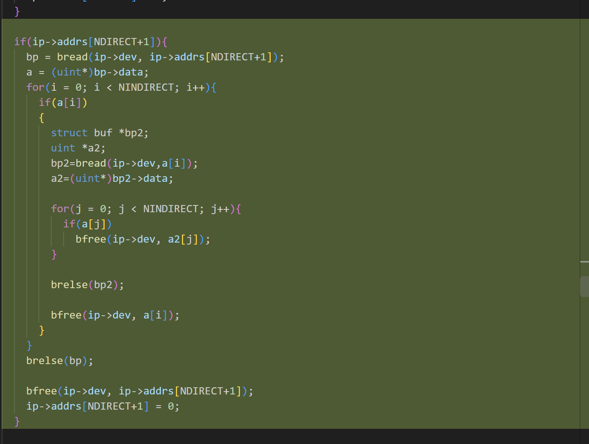

### Symbolic links

**要求：**

为 xv6 添加符号链接功能，实现 `symlink(target, path)` 系统调用，创建保存目标路径的新型 inode，并在 `open()` 时自动递归解析符号链接。增加 `T_SYMLINK` 文件类型和 `O_NOFOLLOW` 标志，使程序可以选择打开链接本身，同时设置最大解析深度以检测循环链接。其他系统调用仍操作符号链接本身，不需要支持目录符号链接。

**解决：**

1. 给 `symlink` 分配系统调用编号

在 `kernel/syscall.h` 中添加一个编号：

```
#define SYS_symlink 22
```

2. 在用户态声明 `symlink()`

在 `user/user.h` 的系统调用声明区域添加：

```c
int symlink(const char*,const char*);//target path
```

创建符号链接 `path`，使其指向 `target`。

3. 在 `user/usys.pl` 中添加系统调用桩

添加：

```
entry("symlink");
```

4. 在内核中注册系统调用

在 `kernel/syscall.c` 中添加声明：

```c
extern uint64 sys_symlink(void);
```

然后在 `syscalls[]` 数组中添加：

```c
[SYS_symlink] sys_symlink,
```

5. 添加符号链接文件类型

在 `kernel/stat.h` 中添加：

```c
#define T_SYMLINK 4   //符号链接
```

6. 添加 `O_NOFOLLOW` 标志

在 `kernel/fcntl.h` 中添加：

```c
#define O_NOFOLLOW 0x800  //打开软链接本身，按位或组合
```

7. 把测试程序加入编译

在 `Makefile` 的 `UPROGS` 下添加：

```
$U/_symlinktest\
```

8. 实现 `sys_symlink()`

在 `kernel/sysfile.c` 中添加：

```c
//接收用户传入的目标路径 target 和链接路径 path，创建一个类型为 T_SYMLINK 的 inode，并把目标路径字符串保存为这个 inode 的文件内容。
uint64 sys_symlink(void){
  char target[MAXPATH];
  char path[MAXPATH];
  struct inode *ip;
  int n;

  // 读取用户传入的两个字符串参数
  if(argstr(0, target, MAXPATH) < 0 ||argstr(1, path, MAXPATH) < 0)
    return -1;

  begin_op();

  // 创建类型为 T_SYMLINK 的 inode
  if((ip = create(path, T_SYMLINK, 0, 0)) == 0){
    end_op();
    return -1;
  }

  // 把结尾的 '\0' 也写入 inode，便于之后直接作为路径使用
  n = strlen(target) + 1;

  if(writei(ip, 0, (uint64)target, 0, n) != n){
    iunlockput(ip);
    end_op();
    return -1;
  }

  iunlockput(ip);
  end_op();

  return 0;
}
```

9. 在 `open()` 中跟随符号链接

在 `kernel/sysfile.c` 的 `sys_open()` 中添加：

```c
// 如果没有设置 O_NOFOLLOW，就不断跟随符号链接
  if(!(omode & O_NOFOLLOW)){
    int depth = 0;

    while(ip->type == T_SYMLINK){
      char target[MAXPATH];

      // 防止 a -> b -> a 之类的循环
      if(depth++ >= 10){
        iunlockput(ip);
        end_op();
        return -1;
      }

      n = readi(ip, 0, (uint64)target, 0, MAXPATH);

      if(n <= 0 || n > MAXPATH){
        iunlockput(ip);
        end_op();
        return -1;
      }

      target[MAXPATH - 1] = '\0';

      // 释放当前符号链接 inode
      iunlockput(ip);

      // 查找符号链接指向的路径
      if((ip = namei(target)) == 0){
        end_op();
        return -1;
      }
      //锁定新目标inode
      ilock(ip);
    }
  }
```

### Lab总结

**实验结果：**

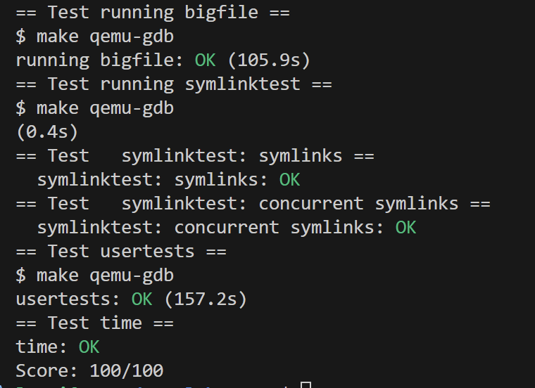

**问题与解决**

1. 新分配的间接块信息没有持久化

在 `bmap()` 中修改间接块中的地址后，没有调用 `log_write()`，更新可能无法正确写入日志和磁盘。解决这个问题，每次向间接块写入新块号后调用：

```c
log_write(bp);
```

2. 不理解符号连接的含义

最初不理解题目的要求，不清楚符号链接保存的究竟是目标文件的 inode，还是目标文件的路径。

通过分析查阅，明确软连接本身是一个独立的特殊文件，其 inode 类型为 `T_SYMLINK`，数据块中保存的是目标文件的路径字符串，而不是目标文件的 inode 编号。

例如：

```
symlink("/a/file", "/link");
```

表示创建一个名为 `/link` 的符号链接，其内容为：

```
/a/file
```

访问：

```
open("/link", O_RDONLY);
```

时，内核先找到 `/link` 的 inode，发现其类型为 `T_SYMLINK`，然后读出保存的路径 `/a/file`，再通过 `namei()` 查找真正的目标文件。

**实验心得**

通过 Large files 实验，我进一步理解了 xv6 inode 从逻辑块号到磁盘块号的映射过程。二级间接块并不是简单增加一个地址，而是增加了一层索引结构。实现时不仅要考虑文件增长时如何分配，还必须考虑文件删除时如何沿相反方向完整释放资源。这让我认识到，修改数据结构后，分配、访问、持久化和释放逻辑必须保持一致。Symbolic links 实验让我认识了符号链接。符号链接的本质不是直接保存目标 inode，而是保存目标路径，因此能够建立指向尚不存在文件的链接。

总而言之，这两个实验使我进一步熟悉了 xv6 的 inode 结构、路径查找等内容。同时认识到，修改文件系统不能只考虑正常访问，还必须同步处理资源释放、磁盘格式一致性等问题，才能保证系统稳定运行。

------

## Lab: mmap

### Lab: mmap

**要求：**

为 xv6 实现文件内存映射系统调用 `mmap()` 和 `munmap()`。使用 VMA 记录每个进程的映射区域，并通过缺页异常按需分配页面、读取文件内容和设置访问权限；解除 `MAP_SHARED` 映射时需将修改写回文件。同时处理部分解除映射、进程退出清理及 `fork()` 继承映射，最终通过 `mmaptest` 和 `usertests`。

也就是为 xv6 添加文件内存映射功能，让程序可以像访问普通内存一样读取或修改文件内容，并能在不需要时取消映射。内核需要负责记录映射区域、按需加载文件数据、保存共享映射的修改，以及在进程退出或创建子进程时正确处理这些映射。

**解决方法：**

1. 切换到 `mmap` 分支

```
git checkout mmap
```

2. 将测试程序加入编译

在 `Makefile` 的 `UPROGS` 中添加：

```
$U/_mmaptest\
```

3. 在用户态声明系统调用

在 `user/user.h` 中添加：

```c
void *mmap(void *, int, int, int, int, int);
int munmap(void *, int);
```

4. 添加用户态系统调用桩

在 `user/usys.pl` 中添加：

```
entry("mmap");
entry("munmap");
```

5. 分配系统调用编号

在 `kernel/syscall.h` 中添加编号，例如：

```c
#define SYS_mmap   22
#define SYS_munmap 23
```

6. 在内核中注册系统调用

在 `kernel/syscall.c` 中添加：

```c
extern uint64 sys_mmap(void);
extern uint64 sys_munmap(void);
```

在 `syscalls[]` 数组中添加：

```c
[SYS_mmap]   sys_mmap,
[SYS_munmap] sys_munmap,
```

7. 为每个进程添加 VMA

在 `kernel/proc.h` 的 `struct proc` 前添加：

```c
#define NVMA 16

struct vma {
  int used;            // 这个 VMA 是否正在使用
  uint64 addr;         // 映射起始虚拟地址
  uint64 length;       // 实际请求的映射长度
  int prot;            // PROT_READ、PROT_WRITE
  int flags;           // MAP_SHARED、MAP_PRIVATE
  uint64 offset;       // 文件起始偏移
  struct file *file;   // 被映射的文件
};
```

然后在 `struct proc` 中添加：

```c
struct vma vmas[NVMA];       //虚拟内存区域
```

8. 初始化进程的 VMA

在 `kernel/proc.c` 的 `allocproc()` 中添加：

```c
//初始化清零
memset(p->vmas, 0, sizeof(p->vmas));
```

9. 实现 `sys_mmap()`

在 `kernel/sysfile.c` 中添加：

```c
uint64 sys_mmap(void)
{
  uint64 requested_addr;
  int length;
  int prot;
  int flags;
  int fd;
  int offset;
  struct file *f;
  struct proc *p = myproc();
  struct vma *v = 0;

  if(argaddr(0, &requested_addr) < 0)
    return -1;
  if(argint(1, &length) < 0)
    return -1;
  if(argint(2, &prot) < 0)
    return -1;
  if(argint(3, &flags) < 0)
    return -1;
  if(argfd(4, &fd, &f) < 0)
    return -1;
  if(argint(5, &offset) < 0)
    return -1;

  // MAP_SHARED + PROT_WRITE 最终需要写回文件，
  // 因此文件必须以可写方式打开。
  if((flags & MAP_SHARED) &&(prot & PROT_WRITE) && f->writable == 0)
    return -1;

  // 找一个空闲 VMA。
  for(int i = 0; i < NVMA; i++){
    if(p->vmas[i].used == 0){
      v = &p->vmas[i];
      break;
    }
  }

  if(v == 0)
    return -1;

  uint64 maplen = PGROUNDUP((uint64)length);
  
  /*
   * TRAMPOLINE 位于 MAXVA-PGSIZE，
   * trapframe 位于 MAXVA-2*PGSIZE。
   * mmap 区域从 trapframe 下方向低地址增长。
   */
  uint64 addr = MAXVA - 2 * PGSIZE;

  for(int i = 0; i < NVMA; i++) {
    if(p->vmas[i].used && p->vmas[i].addr < addr)
      addr = p->vmas[i].addr;
  }

  //防止无符号减法下溢
  if(addr < maplen)
    return -1;

  //在最低 VMA 的下面分配
  addr -= maplen;

  if(addr < PGROUNDUP(p->sz))
    return -1;
  
  v->used = 1;
  v->addr = addr;
  v->length = length;
  v->prot = prot;
  v->flags = flags;
  v->offset = offset;
  v->file = filedup(f);

  return addr;
}
```

这个函数的作用是：在进程的虚拟地址空间中建立一段“文件到内存”的映射，并把这段映射的起始虚拟地址返回给用户程序。这里只记录 VMA，不分配物理页，也不读取文件。

10. 实现 mmap 缺页加载

在 `kernel/trap.c` 中添加辅助函数，作用是处理进程第一次访问 `mmap()` 映射区域时产生的缺页异常，按需分配物理页，并把对应的文件内容加载到该页面中。

```c
static int mmap_page_fault(struct proc *p, uint64 fault_addr, uint64 cause){
  struct vma *v = 0;

  // 找到包含缺页地址的 VMA
  for(int i = 0; i < NVMA; i++) {
    if(p->vmas[i].used &&fault_addr >= p->vmas[i].addr &&fault_addr < p->vmas[i].addr + p->vmas[i].length)
    {
      v = &p->vmas[i];
      break;
    }
  }

  if(v == 0)
    return -1;

  // load page fault，但 VMA 不允许读
  if(cause == 13 && !(v->prot & PROT_READ))
    return -1;

  // store page fault，但 VMA 不允许写
  if(cause == 15 && !(v->prot & PROT_WRITE))
    return -1;

  // 映射必须以页为单位
  uint64 va = PGROUNDDOWN(fault_addr);

  char *mem = kalloc();
  if(mem == 0)
    return -1;

  // 文件最后一页可能不足 4096 字节，剩余部分应为 0
  memset(mem, 0, PGSIZE);

  uint64 file_offset = v->offset + (va - v->addr);
  uint64 remaining = v->length - (va - v->addr);
  uint64 read_size = remaining < PGSIZE ? remaining : PGSIZE;

  // 从文件中读取这一页对应的数据
  ilock(v->file->ip);
  int n = readi(v->file->ip,0,(uint64)mem,file_offset,read_size);
  iunlock(v->file->ip);

  if(n < 0) {
    kfree(mem);
    return -1;
  }

  //构造页表权限
  int perm = PTE_U;

  if(v->prot & PROT_READ)
    perm |= PTE_R;

  //可写页面/同时添加 PTE_R
  if(v->prot & PROT_WRITE)
    perm |= PTE_R | PTE_W;

  // 建立用户虚拟地址到新物理页的映射
  if(mappages(p->pagetable,va,PGSIZE,(uint64)mem,perm) != 0){
    kfree(mem);
    return -1;
  }
  return 0;
}
```

11. 在 `usertrap()` 中处理 mmap 缺页

在 `kernel/trap.c` 的 `usertrap()` 中添加：

```c
else if(r_scause() == 13 || r_scause() == 15) 
{
    //13独缺页 15写缺页
    if(mmap_page_fault(p, r_stval(), r_scause()) < 0)
        p->killed = 1;
}
```

12. 声明 VMA 解除映射函数

在 `kernel/defs.h` 中添加：

```c
int             vma_munmap(struct proc *, uint64, uint64);//解除映射指定的页面
```

供 `sys_munmap()`、`exit()` 和 `exec()` 共同调用。

13. 实现共享页面写回函数

在 `kernel/proc.c` 中添加：

```c
//写回函数
static int vma_write_page(struct vma *v, uint64 va, uint64 pa, uint64 n)
{
  uint64 done = 0;
  uint64 file_offset = v->offset + (va - v->addr);

  //使用与 filewrite 类似的方法
  int max = ((MAXOPBLOCKS - 1 - 1 - 2) / 2) * BSIZE;

  while(done < n) {
    uint64 count = n - done;
    if(count > max)
      count = max;

    begin_op();
    ilock(v->file->ip);
    int written = writei(v->file->ip, 0, pa + done,file_offset + done, count);
    iunlock(v->file->ip);
    end_op();

    if(written != count)
      return -1;

    done += written;
  }
  return 0;
}
```

14. 实现 `vma_munmap()`

继续在 `kernel/proc.c` 中添加：

```c
int vma_munmap(struct proc *p, uint64 addr, uint64 length)
{
  struct vma *v = 0;

  if(length == 0)
    return -1;

  for(int i = 0; i < NVMA; i++) {
    if(p->vmas[i].used &&addr >= p->vmas[i].addr &&addr + length <= p->vmas[i].addr + p->vmas[i].length) {
      v = &p->vmas[i];
      break;
    }
  }

  if(v == 0)
    return -1;

  uint64 old_addr = v->addr;
  uint64 old_length = v->length;
  uint64 end = addr + length;

  //只会删除开头、结尾或者整个 VMA
  if(addr != old_addr && end != old_addr + old_length)
    return -1;

  uint64 first = PGROUNDDOWN(addr);
  uint64 last = PGROUNDUP(end);

  for(uint64 va = first; va < last; va += PGSIZE)
  {
    pte_t *pte = walk(p->pagetable, va, 0);

    if(pte == 0 || (*pte & PTE_V) == 0)
      continue;

    if(v->flags & MAP_SHARED)
    {
      uint64 page_start = va;
      uint64 page_end = va + PGSIZE;
      uint64 mapped_end = old_addr + old_length;

      if(page_end > mapped_end)
        page_end = mapped_end;

      if(page_end > page_start)
      {
        uint64 pa = PTE2PA(*pte);
        uint64 n = page_end - page_start;

        if(vma_write_page(v, va, pa, n) < 0)
          return -1;
      }
    }
    uvmunmap(p->pagetable, va, 1, 1);
  }
  //整个
  if(addr == old_addr && end == old_addr + old_length)
  {
    fileclose(v->file);
    memset(v, 0, sizeof(*v));
  } else if(addr == old_addr)//开头
  {
    v->addr += length;
    v->offset += length;
    v->length -= length;
  } else //结尾
  {
    v->length -= length;
  }
  return 0;
}
```

该函数作用是在当前进程的虚拟地址空间中，解除从`addr`开始、长度为`length`字节的`mmap`映射。

15. 实现 `sys_munmap()`

在 `kernel/sysfile.c` 中添加：

```c
uint64 sys_munmap(void)
{
  uint64 addr;
  int length;

  if(argaddr(0, &addr) < 0 ||argint(1, &length) < 0)
    return -1;

  if(length <= 0)
    return -1;

  return vma_munmap(myproc(), addr, length);
}
```

16. 在 `exit()` 中清理全部 VMA

在 `kernel/proc.c` 的 `exit()` 中：

```c
//解除映射
for(int i = 0; i < NVMA; i++) {
    if(p->vmas[i].used) {
        uint64 addr = p->vmas[i].addr;
        uint64 length = p->vmas[i].length;
        vma_munmap(p, addr, length);
    }
}
```

17. 让 `fork()` 继承 VMA

在 `kernel/proc.c` 的 `fork()` 中添加：

```c
for (i = 0; i < NVMA; i++) {
  if (p->vmas[i].used) {
    np->vmas[i] = p->vmas[i];

    np->vmas[i].file =
      filedup(p->vmas[i].file);
  }
}
```

子进程只继承 VMA 信息，不共享父进程的 `mmap` 物理页。子进程首次访问时重新从文件加载页面。

18. 在 `exec()` 中清理旧映射

在 `kernel/exec.c` 中添加：

```c
for (int i = 0; i < NVMA; i++) {
  if (p->vmas[i].used) {
    uint64 addr = p->vmas[i].addr;
    uint64 length = p->vmas[i].length;

    vma_munmap(p, addr, length);
  }
}
```

### Lab总结

**实验结果：**

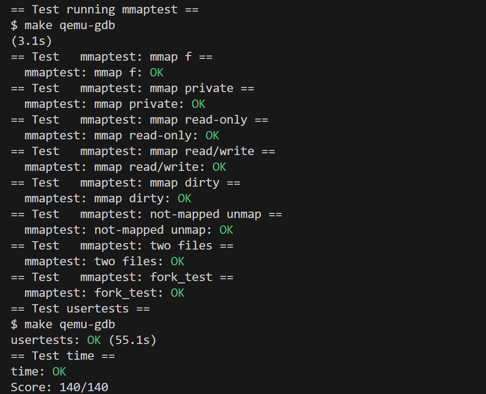

**问题与解决**

在最初实现 `munmap()` 时，只使用 `uvmunmap()` 解除了用户页表中的映射并释放物理页，没有处理映射页面中被修改的数据。因此，程序通过映射内存修改文件内容后，内存中的内容虽然发生了变化，但磁盘文件仍然保持原来的数据。

问题的原因是，缺页处理程序使用 `readi()` 将文件内容读取到新分配的物理页后，文件和物理页只是内容相同，两者之间并不存在自动同步关系。用户修改映射页面时，实际修改的是物理内存，不会自动调用文件系统的写操作。为了解决这一问题，在 `munmap()` 中判断映射类型；对于 `MAP_SHARED`，先通过 `writei()` 将页面内容写回文件，再调用 `uvmunmap()` 解除映射。对于 `MAP_PRIVATE`，直接释放页面。

**实验心得**

本实验让我进一步理解了虚拟内存、文件系统和缺页异常之间的联系。`mmap()` 并不是简单地将文件内容复制到内存，而是先用 VMA 描述一段虚拟地址范围，在程序真正访问时再通过缺页异常分配页面并读取文件，这体现了按需分配和懒加载的设计思想。

实验中最重要的是维护不同内核对象的生命周期，包括 VMA、页表映射、物理页和文件引用。任何一个环节处理不完整，都可能造成页面泄漏、文件引用泄漏或重复释放。

------

## Lab: networking

### Lab: networking

**要求：**

为 xv6 的 E1000 网卡实现设备驱动，完成 `e1000_transmit()` 和 `e1000_recv()`。通过 DMA 描述符环管理数据包发送与接收，正确更新 `E1000_TDT`、`E1000_RDT` 寄存器，分配和释放 `mbuf`，并使用锁保证并发安全。最终使 xv6 能够完成 ARP、UDP、ping 和 DNS 通信，并通过 `nettests` 与 `make grade`。

简而言之，就是为 xv6 编写一个简单的网卡驱动，让操作系统能够通过虚拟网卡发送和接收网络数据。程序需要管理待发送和已接收的数据包，并把网卡收到的数据交给 xv6 的网络协议栈处理，从而实现 xv6 与宿主机及互联网之间的基本通信。

**解决：**

1. 切换到 `net` 分支

```
git checkout net
```

2. 实现 `e1000_transmit()`

在 `kernel/e1000.c` 中完成发送函数：

```c
int
e1000_transmit(struct mbuf *m)
{
  acquire(&e1000_lock);

  // TDT 指向驱动应该填写的下一个发送描述符。
  uint32 index = regs[E1000_TDT];//读取网卡的 TDT 硬件寄存器
  struct tx_desc *desc = &tx_ring[index];

  // DD 没有置位，说明网卡还没有使用完这个描述符。
  // 此时不能覆盖它，否则会破坏尚未完成的发送操作。
  if ((desc->status & E1000_TXD_STAT_DD) == 0) {
    release(&e1000_lock);
    return -1;
  }

  // 网卡已经发送完这个位置原来的数据。
  // 因此现在可以释放原来由这个描述符引用的 mbuf。
  if (tx_mbufs[index] != 0) {
    mbuffree(tx_mbufs[index]);
    tx_mbufs[index] = 0;
  }

  // 让描述符指向当前要发送的数据包。
  desc->addr = (uint64)m->head;
  desc->length = m->len;

  // EOP：这个描述符包含数据包的最后一段。RS：发送完成后，请网卡把 DD 状态写回来。
  desc->cmd = E1000_TXD_CMD_EOP | E1000_TXD_CMD_RS;

  // 清除旧状态，表示这个描述符现在交给网卡处理。
  desc->status = 0;

  // 保存 mbuf，等网卡发送完成后再释放。
  tx_mbufs[index] = m;

  // 保证描述符内容先写入内存，再通知网卡。
  __sync_synchronize();

  // 推进发送环的尾指针，通知网卡有新包需要发送。
  regs[E1000_TDT] = (index + 1) % TX_RING_SIZE;

  release(&e1000_lock);
  return 0;
}
```

3. 实现 `e1000_recv()`

在 `kernel/e1000.c` 中完成接收函数：

```c
static void
e1000_recv(void)
{
  while (1)
  {
    acquire(&e1000_lock);

    // RDT 指向驱动最后处理完并归还给网卡的描述符。
    // 所以下一个可能包含新数据包的位置是 RDT + 1。
    uint32 index = (regs[E1000_RDT] + 1) % RX_RING_SIZE;
    struct rx_desc *desc = &rx_ring[index];

    // 没有 DD，说明网卡还没有在这个描述符中放入新数据。
    if ((desc->status & E1000_RXD_STAT_DD) == 0) {
      release(&e1000_lock);
      break;
    }

    // 取出网卡刚刚写入数据的旧 mbuf。
    struct mbuf *m = rx_mbufs[index];
    m->len = desc->length;

    // 当前 mbuf 将交给网络协议栈。
    // 因此必须给网卡准备一个新的空 mbuf。
    struct mbuf *new_m = mbufalloc(0);
    if (new_m == 0)
      panic("e1000_recv");

    rx_mbufs[index] = new_m;
    desc->addr = (uint64)new_m->head;

    // 清除完成状态，让网卡以后可以再次使用这个描述符。
    desc->status = 0;

    // 确保新缓冲区地址和状态已经写入描述符。
    __sync_synchronize();

    // 把这个描述符归还给网卡。
    regs[E1000_RDT] = index;

    release(&e1000_lock);

    // 交给 IP/ARP/UDP 网络协议栈处理
    net_rx(m);
  }
}
```

### Lab总结

**实验结果：**

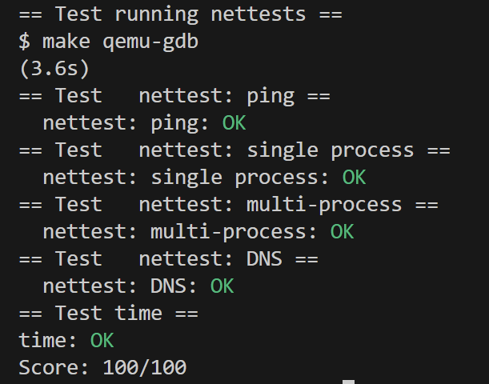

**问题与解决**

本次题目的最大问题就是对于题目的理解，通过查阅，理解了本实验的核心是通过发送环和接收环与网卡交换数据：

- 发送时，CPU 从 `E1000_TDT` 指向的位置取得发送描述符，将 `mbuf` 的地址和长度写入描述符，再移动 `TDT`，通知网卡处理该数据包。
- 接收时，网卡先把数据写入接收描述符对应的 `mbuf`，然后设置 `DD` 状态位。CPU 检查到该状态位后，将数据包交给网络协议栈，并为描述符补充一个新的缓冲区。
- 描述符数组是环形结构，到达数组末尾后需要通过取模运算回到开头。

其中最重要的是正确理解 `DD` 状态位和 `mbuf` 的所有权。发送描述符的 `DD` 位没有设置时，说明网卡仍在使用该描述符，此时不能覆盖描述符中的内容，也不能释放旧的 `mbuf`。只有网卡发送完成并设置 `DD` 后，驱动才能释放旧缓冲区并重新使用该描述符。接收过程中的缓冲区所有权也发生了转移：原来的 `mbuf` 在接收到数据后要交给 `net_rx()`，不能继续留在接收环中。因此必须先分配一个新的 `mbuf` 放入描述符，再把旧的 `mbuf` 传给网络协议栈。

**实验心得**

总体来说，这次实验把网络协议栈、内存管理、并发控制和硬件设备操作联系在了一起。完成实验后，我不仅理解了 E1000 网卡驱动的基本收发过程，还加深了我对设备驱动、环形队列以及并发控制的理解。


------

## 总结

通过完成 xv6 的11个实验，我对操作系统从用户程序到内核底层实现的完整工作流程有了更加系统和深入的认识。这些实验并不是彼此孤立的，而是从 UNIX 用户工具开始，逐步深入系统调用、虚拟内存、异常处理、进程管理、并发控制、文件系统和设备驱动，最终形成了一条较为完整的操作系统知识链。

在 `util` 实验中，我通过实现 `sleep`、`pingpong`、`primes`、`find` 和 `xargs`，熟悉了 xv6 用户程序的编写方式，并掌握了 `fork`、`pipe`、`read`、`write`、`exec` 和 `wait` 等基本 UNIX 系统调用。这部分实验让我直观理解了进程创建、进程间通信、文件描述符以及管道的工作方式。

在 `syscall` 实验中，我实现了系统调用跟踪和系统信息查询功能，了解了一个系统调用从用户态接口、汇编调用桩、系统调用编号，到内核处理函数的完整执行路径。

在 `pgtbl` 实验中，深入学习了 RISC-V 三级页表、虚拟地址转换和页表项权限。通过打印页表、为每个进程建立独立的内核页表，以及同步用户地址映射，认识内核如何管理用户和内核地址空间。

在 `traps` 实验中，我学习了系统调用、中断和异常如何统一通过 trap 机制进入内核。通过分析 RISC-V 汇编、实现内核调用栈回溯和用户级定时报警，我对寄存器保存、栈帧结构、trapframe，以及用户态和内核态之间的切换过程有了更清晰的认识。

在 `lazy` 实验中，我实现了用户堆内存的懒分配。该实验让我理解了操作系统可以先扩展进程的虚拟地址范围，在进程真正访问页面并触发缺页异常时，再分配物理内存。同时还需要处理非法地址、内存不足、负数 `sbrk()`、用户栈保护页以及 `fork()` 等特殊情况。

在 `cow` 实验中，我通过写时复制优化了 `fork()`。父子进程最初共享相同的物理页面，只有在发生写操作时才复制页面。实现过程中需要正确设置页表权限、处理写缺页异常，并使用引用计数管理共享物理页的生命周期。

在 `thread` 实验中，我完成了用户级线程上下文切换、基于线程的哈希表并行化以及可重复使用的屏障。通过保存和恢复寄存器，我理解了线程切换的底层原理；通过互斥锁和条件变量，我认识到并发程序不仅需要保证正确性，还需要尽量减小锁的粒度，从而提升并行性能。

在 `lock` 实验中，我将物理内存分配器和磁盘缓冲区缓存中的全局锁拆分为多把锁。实验表明，虽然使用一把大锁更容易保证正确性，但会造成严重的锁竞争；使用每 CPU 空闲链表、哈希桶锁等细粒度设计，可以让互不冲突的操作并行执行。

在 `fs` 实验中，我通过实现大文件和符号链接功能，掌握了 inode、数据块、直接块、间接块、目录项和路径解析的工作方式。尤其是双重间接块的实现，使我理解了文件系统如何通过多级索引支持更大的文件；符号链接则让我进一步理解了路径查找和文件类型处理。

在 `mmap` 实验中，我实现了文件到进程虚拟地址空间的映射，并结合缺页异常实现按需加载。该实验综合运用了虚拟内存、文件系统、进程管理和异常处理等知识，也让我理解了 `MAP_SHARED`、`MAP_PRIVATE`、权限检查、写回文件和解除映射的基本机制。

在 `net` 实验中，我完成了 E1000 网卡驱动的数据包发送和接收功能。通过操作发送描述符环、接收描述符环和设备寄存器，我了解了操作系统与硬件设备之间的交互方式。

总体而言，xv6 实验让我将操作系统课程中的抽象概念与实际代码联系起来。理解了进程、系统调用、虚拟内存、文件系统、锁和设备驱动等基本原理，也体会到了操作系统各模块之间紧密的依赖关系。
